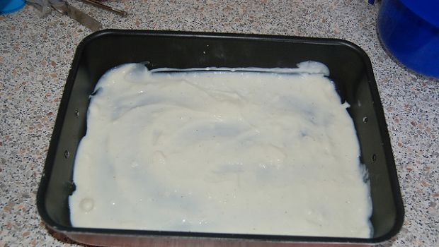

La besciamella è una ricetta base della nostra cultura gastronomica. La utilizziamo, ad esempio, per rendere più cremose e appetitose le nostre lasagne al forno, ma possiamo trovarla anche in tantissime altre ricette che richiedono il suo gusto delicato e unico. E’ formata da pochi e semplici ingredienti e non è difficile da realizzare.

La perfetta besciamella fatta in casa non deve avere grumi, per questo è bene mescolare di continuo il composto anche durante la cottura ed eventualmente filtrarla al colino se proprio non siamo riusciti ad evitarli. La besciamella si può preparare per tempo e poi può essere utilizzata in mille preparazioni diverse.

Ingredients
===========

* 1l di latte fresco intero
* 70gr di burro
* 70gr di farina
* sale
* pepe bianco
* noce moscata

Preparation
===========

Fate sciogliere il burro a fiamma bassa.

Setacciate la farina e unitela al burro sciolto, mescolando con la frusta.

Fate cuocere il composto finché non sarà dorato, continuando a mescolare.

Aggiungete il latte a temperatura ambiente, poco alla volta e continuando a mescolare con la frusta per evitare grumi. Quando il latte è finito portate a bollore e fate cuocere ancora per qualche minuto.

Togliete la besciamella dal fuoco e passatela al colino se ci sono dei grumi.

Aggiungete due pizzichi di sale, un po’ di pepe e di noce moscata, mescolate e lasciate intiepidire.

Notes
=====

