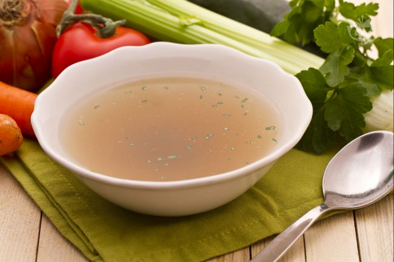

Il brodo vegetale è una ricetta di base della cucina tradizionale italiana, si ottiene con la bollitura  di verdura freschissima, le verdure di base che sui utilizzano sono: carote, sedano, cipolle a cui possono essere aggiunte verdure di stagione a scelta.

Il brodo vegetale si utilizza nelle preparazioni a lunga cottura per insaporire ad esempio risotti, orzotti, arrosti e per accompagnare la pasta fresca come cappelletti e tortellini.

Ingredients
===========

For 3 litres of broth
* 3l Acqua  
* 3 foglie di Alloro
* 1 Zucchine
* 1 Patata
* 2 Pomodori medi
* 1 spicchio di Aglio in camicia 
* 1 ciuffo di Prezzemolo
* 2 Carote
* 2 Cipolle
* 3 coste di Sedano

Preparation
===========

Iniziate la preparazione del brodo vegetale lavando bene tutte le verdure, pelate le carote privandole delle estremità e tagliatele in due, sbucciate le cipolle e tagliatele a metà. Tagliate i gambi di sedano in 3 parti, private le zucchine delle estremità e tagliatele in pezzi grossi. Sbucciate la patata,tagliatela in quarti e spellate i due pomodori.

Mettete sul fuoco 3 lt di acqua fredda e aggiungete tutte le verdure, poi l’alloro, alcuni grani di pepe nero e lo spicchio d’aglio non sbucciato.

Portate a ebollizione il tutto e poi aggiungete il sale e il prezzemolo ben lavato (anche i gambi). Chiudete con un coperchio e cuocete per circa un’ora e mezza. A cottura ultimata aggiustate di sale e filtrate il brodo con un colino.                        

Notes
=====

Potete conservare il brodo vegetale, privo delle verdure, in frigorifero anche per una settimana oppure potete congelarlo nelle pratiche forme per il ghiaccio, così da utilizzarne un cubetto o più all'occorrenza.
