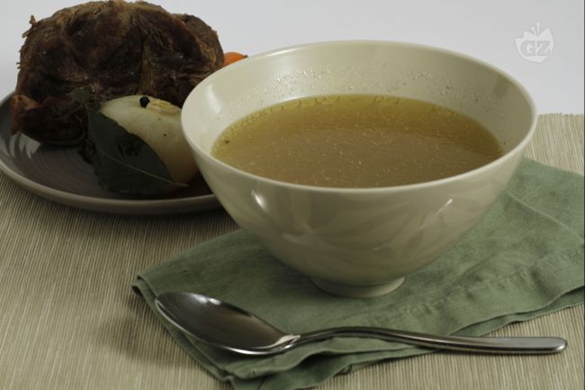

Il brodo di carne è una preparazione base in cucina che serve per tantissime altre ricette; oltre ad essere un ottimo tonico nei momenti di debilitazione fisica, è perfetto come base per dei risotti corposi a base di carne oppure per allungare arrosti o altre preparazioni sempre a base di carne.                

Ingredients
===========

* 1kg Carne bovina   
* 3l Acqua 
* 5 Chiodi di garofano
* 3 bacche di Ginepro
* Pepe misto in grani
* 3 foglie di Alloro
* 2 Cipolle
* 2 Carote
* 2-3 coste di Sedano
* 1 tbsp Sale grosso

Preparation
===========

Mondate le cipolle, le carote e il sedano; riempite una capiente pentola con l’acqua fredda e immergetevi le verdure; steccate la cipolla con le foglie di alloro e i chiodi di garofano e unite anche queste nell’acqua; aggiungete il ginepro e il pepe in grani.

In ultimo anche i pezzi di carne e ossa, regolate di sale e ponete sul fuoco medio e portate lentamente a bollore; abbassate la fiamma e coprite. Lasciate sobbollire dolcemente per circa 2-3 ore.

Trascorso questo tempo prelevate le verdure e la carne (che potrete o consumare con un bagnetto verde oppure macinare per fare delle polpette o un polpettone), regolate nuovamente di sale se necessario e usate il brodo per le preparazioni che vorrete.    

Notes
=====

La carne e le ossa in cottura rilasciano parte del loro grasso, ma è normale, e vedrete in superficie una patina quasi oleosa appena il brodo sarà caldo; il trucco per togliere questa patina è far freddare completamente il brodo nella pentola, meglio se al freddo, in frigo oppure anche sul balcone fino a che questa patina di grasso solidificherà e diventerà quasi biancastra; a questo punto potete eliminarla prelevandola con una schiumarola. Il brodo può anche essere porzionato e congelato in contenitori a chiusura ermetica.
