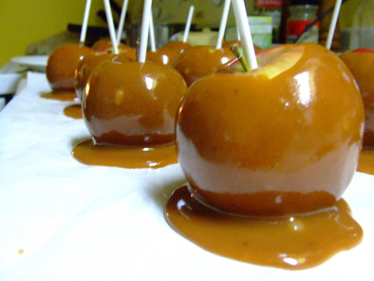

Ingredients
===========

* 400gr Zucchero

Preparation
===========

Versate qualche cucchiaio di zucchero in un pentolino per scioglierlo mescolando di continuo con un cucchiaio di legno. La fiamma deve essere alta.

Aggiungete lo zucchero quando il precedente si è sciolto, abbassando la fiamma quando lo zucchero comincia a prendere colore.

Avvicinate e allontanate il pentolino dal fuoco continuando a mescolare.

Notes
=====
