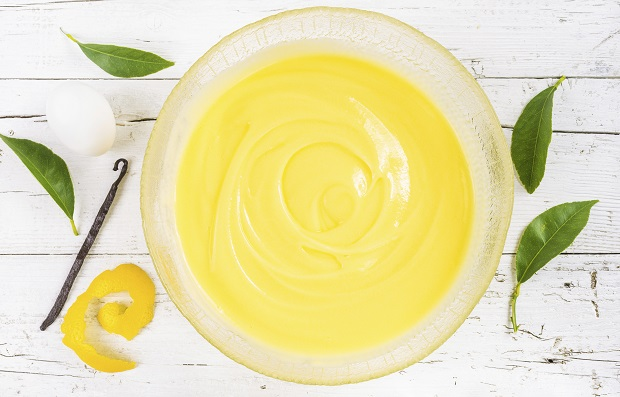

La crema pasticcera è una ricetta di base della cucina italiana, una crema versatile e sfiziosa che si può utilizzare in tanti modi diversi. La funzione principale della crema pasticcera è la farcitura di torte a base di Pan di Spagna, ma si può anche usare per farcire i biscottini, crostate e tartellette oppure si può usare per comporre dei dolci più elaborati, ad esempio la Zuppa inglese o la torta Charlotte. La crema pasticcera è la ricetta di base da cui si possono fare anche la crema al limone e al cioccolato, si può gustare al cucchiaio al posto della cioccolata calda oppure si può preparare la crema fritta, un dolcetto facile ma irresistibile. Vediamo insieme la ricetta della crema pasticcera.

Ingredients
===========

* 4 tuorli
* 500ml di latte
* 85gr di zucchero
* 40gr di amido
* Vaniglia

Preparation
===========

La prima cosa da fare è scaldare il latte, mettetelo in una brocca e riscaldatelo nel microonde oppure usate un pentolino. Se occorre filtrate il latte con un colino. Prendete una ciotola e mettete i tuorli delle uova e lo zucchero, montateli bene con la frusta a mano fino ad avere un composto gonfio e spumoso. Incorporate la farina setacciata, poca per volta, e mescolate sempre con la frusta per incorporarla al meglio.

Se il composto tende ad indurirsi potete aggiungere 2 – 3 cucchiai di latte tiepido. Aggiungete il latte a filo mescolando in continuazione fino ad avere una pastella liscia e senza grumi. Incorporate anche i semini di mezza bacca di vaniglia oppure un cucchiaio di estratto.

Mettete il latte in una pentola e versate la pastella di tuorli, zucchero e farina, mescolate bene con la frusta in modo da scioglierla bene. Questo passaggio è essenziale perché se non mescolate bene dopo pochi minuti di cottura di formeranno i grumi.

Accendete il fuoco e regolatelo al minimo, cuocete la crema mescolandola in continuazione con la frusta, facendo attenzione al fondo e ai bordi. Appena inizia a sobbollire è pronta, a questo punto dipende da come vi serve la crema, se la volete abbastanza liquida potete spegnere, se la volete far stringere ancora un po’ proseguite la cottura per qualche altro minuto.

Se la crema pasticcera vi serve per farcire le torte dovete farla raffreddare completamente, mettetela in una ciotola e copritela con la pellicola, se la fate appoggiare tratterrà l’umidità evitando la patina che si forma in superficie. Se non vi piace la vaniglia potete sostituirla con scorza di arancia o limone oppure con una puntina di cannella. La crema pasticcera potete farla sostituendo il latte vaccino con uno vegetale.

Notes
=====
