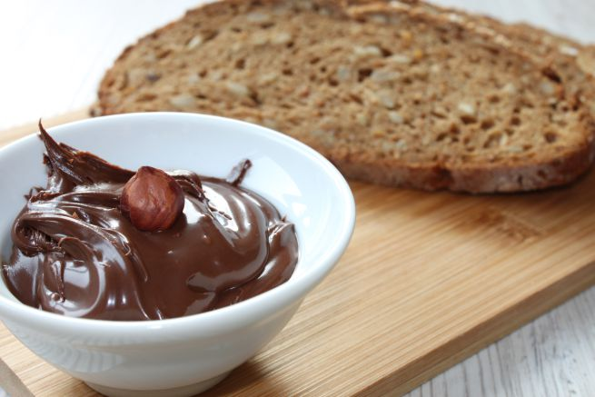

La crema spalmabile al cioccolato fondente è una prelibatezza alla quale è difficile riuscire a dire di no. Buonissima da sola sul cucchiaino (o per i più golosi anche leccandosi le dita), è inimitabile per una colazione a base di pane con cioccolato e un bel bicchiere di latte freddo. Senza dimenticare che può tornare utile per poter realizzare tanti dolci diversi.

Oggi vi vogliamo presentare la ricetta della crema spalmabile al cioccolato fondente, semplice da realizzare anche a casa, per poter stupire i nostri ospiti. Potete anche metterla in vasetti colorati e decorati e pensare di regalare questo prodotto frutto del vostro lavoro e della vostra passione per la cucina per Natale o per un'altra occasione. E' simpatica anche come idea per una bomboniera per ogni occasione, non trovate?

Ingredients
===========

* 250gr di cioccolato fondente al 60%
* 250gr di pasta di nocciola
* 125gr di olio extravergine di oliva
* 50gr di cacao amaro in polvere
* la buccia grattugiata di un'arancia

Preparation
===========

Spezzettate il cioccolato a pezzi piccoli.

Sciogliete il cioccolato a bagno maria raggiungendo una temperatura di 45 gradi. Ricordatevi di mescolare spesso.

Togliete la ciotola con il cioccolato dal fuoco e unite tutti gli altri ingredienti, mescolando con una frusta.

Temperate a 23 gradi la crema in un mixer e riempite i vasetti.

Notes
=====
