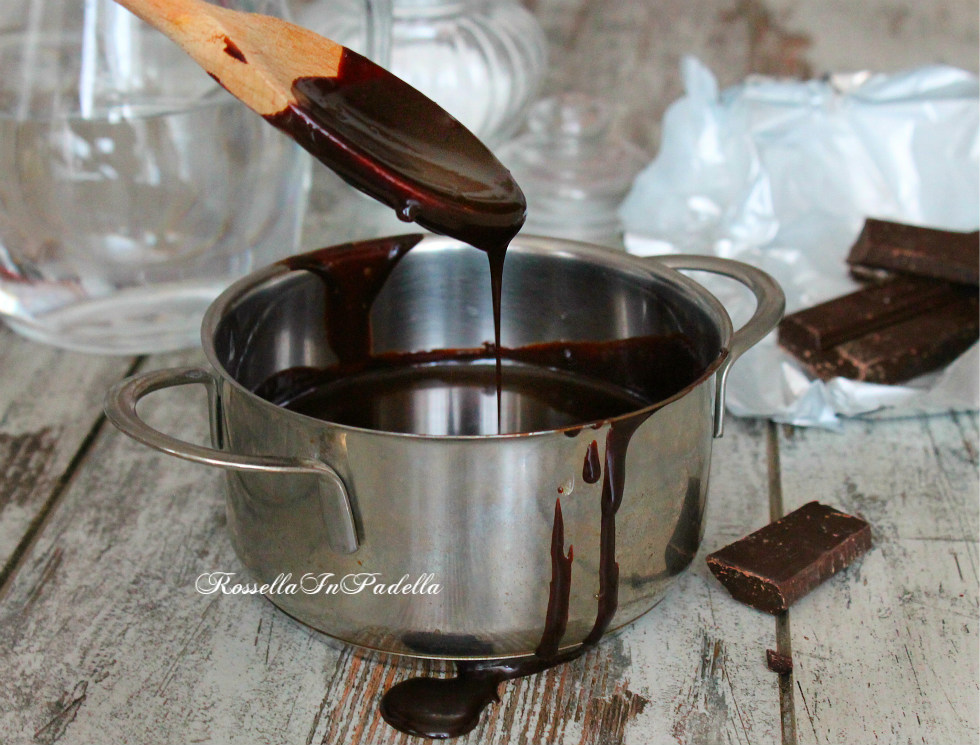

Una di quelle ricette base di cui non si può fare proprio a meno, se amate preparare dolci speciamente se vi divertite a decorarle, a ricoprirle. Perchè il solo cioccolato fuso non basta, non basta fare fondere il cioccolato a bagno maria per ricoprire un dolce, per questi, una volta raffreddato solidificherà inesorabilmente risultando, talvolta, molto duro ed impossibile da tagliare.

Questa ricetta, invece, permette di ottenere una glassa al cioccolato perfetta per ricoprire qualsiasi dolce senza indurire troppo e resistere al taglio.Bastano pochi minuti per prepararla.

Ingredients
===========

* 150gr cioccolato fondente
* 80gr zucchero
* 120ml acqua

Preparation
===========

In un pentolino mettete l’acqua e lo zucchero, lasciate scaldare a fiamma bassa e portate quasi a bollore fino ad ottenere quasi uno sciroppo.

Aggiungete, a questo punto,  il cioccolato. Continuate a mescolare fino a farlo sciogliere completamente. Spegnete il fuoco e lasciate raffreddare. Inizialmente sembrerà troppo liquido ma raffreddando rassoderà. Se, una volta decorati i vostri dolci, ve ne avanzerà, potrete conservarlo per una volta successiva. La glassa al cioccolato non indurisce come farebbe il comune cioccolato fondente sciolto 

Notes
=====

Any personal annotations and advises go here
