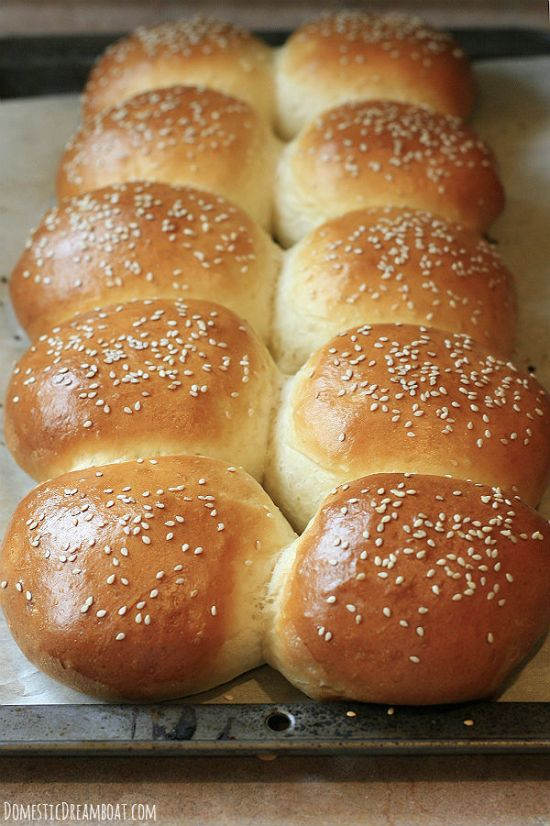

Making your own hamburger buns is easy when you plan ahead. Plus your barbecue guests will be so impressed you made your own buns! 

Ingredients
===========

* 10gr active yeast
* 300ml water
* 400gr all-purpose flour
* 2 eggs
* 45gr melted butter
* 30gr white sugar
* 5gr salt
* oil
* 20ml milk 

Preparation
===========

Stir together yeast, water and 75g flour in the bowl of a stand mixer or a large bowl. Let sit until mixture becomes foamy, 10-15 minutes.

Stir the melted butter, egg, sugar and salt into the yeast mixture. Add the rest of flour and knead with a dough hook, or by hand until all the flour has been incorporated. If the dough remains very sticky, continue adding flour, 1 Tablespoon at a time until the dough is smooth and elastic, and just stops sticking to the bottom of the bowl (make sure all of the previous flour is incorporated before adding more).

Form dough into a smooth ball and brush lightly with oil. Place in a lightly oiled bowl and let rise for about 2 hours, until doubled in size.

Form dough into a log and cut into 8-14 pieces (see note). Work with 1 piece of dough at a time, and keep the remainder covered. Form each piece into a ball, tucking the ends underneath. Slightly flatten the ball with the palm of your hand. Place dough patties on a baking sheet lined with parchment about 1/2" apart. Allow to rise about 1 hour, until doubled.

Heat oven to 190°C. When buns have risen, whisk together egg and milk. Lightly brush the egg mixture on top of each bun, being careful not to collapse the dough (you should have quite a bit of egg wash left over). Immediately sprinkle with sesame seeds or other toppings if desired.

Bake buns for 15-17 minutes, or until golden brown. Cool. If you aren't going to use the buns within 2 days, freeze leftovers.

Notes
=====

For large buns cut dough into 8 pieces. For medium buns, cut into 10 pieces. For small slider buns, cut into 12-14 pieces.

Servings: 10
Calories: 218 kcal
Author: Carissa Serink
