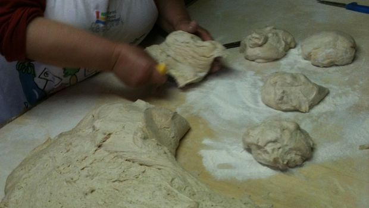

Preparare il lievito madre non è un’impresa impossibile, basta solo seguire i consigli giusti per poterlo realizzare in casa e per poterlo usare in tantissime ricette. Gli ingredienti sono pochi ed essenziali, ma sono indispensabili alcuni accorgimenti per poterlo mantenere in vita e poterlo riutilizzare più e più volte. Il lievito madre diventerà davvero prezioso per tantissime creazioni culinarie.

Il lievito madre, chiamato anche lievito naturale o pasta madre o lievito acido, è un semplice impasto che fermenta nel corso dei giorni e che si contraddistingue per la presenza di batteri del genere Lactobacillus.

Ingredients
===========

* 200gr di farina
* 10cl di acqua
* 1tbsp di olio
* 1tbsp di miele

Preparation
===========

Impastate tutti gli ingredienti per ottenere un composto omogeneo, che lascerete riposare in una ciotola coperta in un angolo protetto della cucina a 22 gradi all’incirca. Ogni giorno date un’occhiata a quello che succede nell’impasto, che entro 3 giorni dovrebbe formare delle bolle e aumentare di volume. Se non lo facesse, buttatelo e ricominciate da capo, perché con tutta probabilità sta creando delle muffe.

Quando il lievito madre sarà fermentato, rinfrescatelo aggiungendo in proporzione altra acqua e farina. Questa operazione deve essere ripetuta almeno due o tre volte prima di usare per la prima volta il lievito.

Ogni volta che vorrete utilizzarlo dovrete rinfrescarlo con dosi proporzionate di acqua e farina, ma andrebbe rinfrescato comunque ogni due giorni.

Notes
=====
