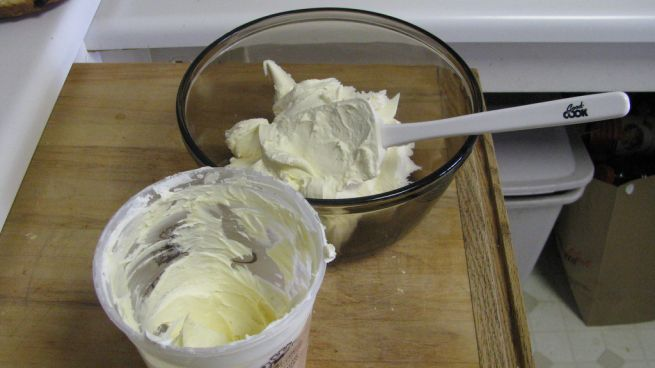

Sembra una cosa difficile, invece poche cose in cucina sono semplici da realizzare come fare il mascarpone in casa. Vi servono appena due ingredienti e pochi attrezzi per ottenere quel formaggio così goloso e utile sia per preparare piatti dolci che per piatti salati. L’origine del mascarpone è la Lombardia, ma anche se abitate altrove potete impararlo facilmente!

Ingredients
===========

* 500ml di panna fresca
* 1tbsp di succo di limone

Preparation
===========

Scaldate la panna in un pentolino mescolando sempre; quando avrà raggiunto gli 85° circa, unite il succo di limone e cuocete per altri 3-5 minuti. Togliete dal fuoco e fate raffreddare per almeno un quarto d’ora; nel frattempo rivestite uno scolapasta con un canovaccio di stoffa pulite e mettete tutto sopra un contenitore.

Versatevi dentro la panna addensata e lasciate riposare il composto in frigo fino a 24 ore: l’azione combinata di temperatura e acidità formeranno naturalmente un ottimo mascarpone.

Notes
=====
