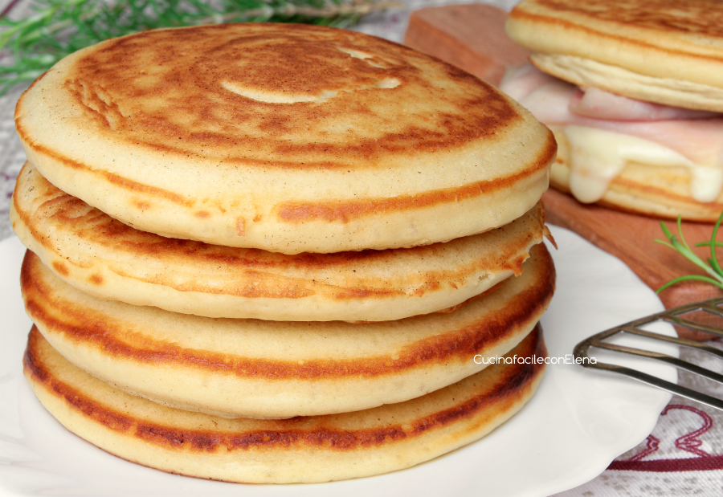

Dopo la mia ricetta dei classici Pancakes dolci che vi è piaciuta tantissimo, ho deciso di realizzarli anche in versione salata e che dire, solo troppo buoni! Soffici come una nuvola, i Pancakes Salati sono alti, spumosi, profumati e saporiti, perfetti da farcire con ciò che preferite. Io li adoro ripieni di salumi e formaggi ma mi piace accompagnarli anche con delle salsine o patè. Provate la mia ricetta dei Pancakes salati, vedrete che bontà!

Ingredients
===========

Per circa 10 pancake:

* 300gr di latte a temperatura ambiente
* 250gr di farina 00
* 50gr di burro fuso
* 2 uova
+ una bustina di lievito per dolci NON vanigliato (15 g)
* 1tbsp di aceto di vino bianco (o di mele)
* 1tsp raso di bicarbonato
* 1tsp di sale
* 1 pizzico di zucchero
* burro q.b. per ungere la padella

Preparation
===========

I Pancakes Salati sono semplici e veloci da preparare, come prima cosa prendete due ciotole, in una mettete tutti gli ingredienti secchi, quindi la farina, il lievito, il bicarbonato, il sale e lo zucchero; nell’altra invece versate tutti gli ingredienti liquidi, ossia il latte, il burro fuso e le uova.

Mescolate separatamente i due composti e poi uniteli. Lavorate velocemente con una frusta a mano, dovrete ottenere una sorta di pastella omogenea e non molto liquida. Mi raccomando, assicuratevi che non ci siano grumi.

Adesso mettete l’ingrediente segreto che contribuirà a rendere i pancakes salati ancora più gonfi e soffici: l’aceto. L’aggiunta è facoltativa ma vi consiglio di usarlo, il sapore non si sentirà assolutamente. Mescolate quindi ancora una volta il composto del pancakes salati per far assorbire per bene l’aceto.

Ungete una padellina con un po’ di burro e fatela scaldare sul fornello, dopodiché versate al centro di essa un mestolo di impasto, non allargatelo perché si espanderà leggermente da solo in cottura.

Fate cuocere i pancakes salati a fuoco dolce 2-3 minuti per lato. Una volta pronti, servite i Pancakes e gustateli con i condimenti che preferiti, sono ottimi sia caldi che freddi!

Notes
=====
