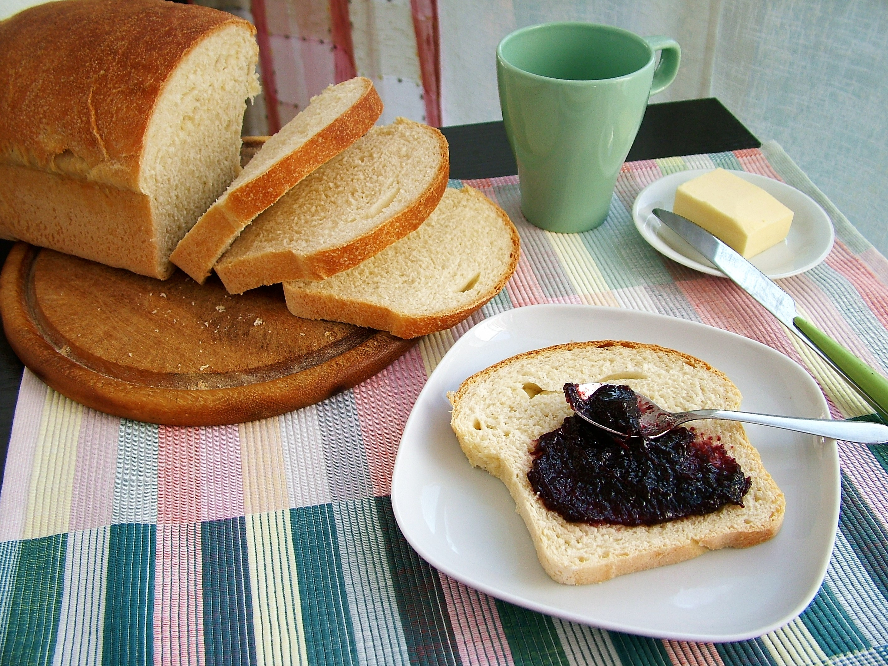

Il pancarré, conosciuto anche come pane in cassetta, pan bauletto, pane da sandwich, pane da tramezzini, pane da toast, è un tipo di pane, dall’impasto particolarmente morbido, generalmente usato per preparare toast, tramezzini, tartine o canapés. È il pane maggiormente diffuso in Giappone, dove è chiamato shokupan e dove viene consumato anche durante i pasti come il nostro comune pane. In lingua inglese è noto come pullman bread, in lingua francese come pain de mie.

Anche se non esistono prove certe, una teoria vorrebbe il pancarré nato a Torino, nel corso del XIX secolo. Non sappiamo se questo sia vero, ma è probabile che nel capoluogo piemontese questo tipo di pane fosse particolarmente diffuso, da cui l´invenzione del tramezzino.

Ingredients
===========

* 500g Farina
* 60gr Burro
* 300ml Latte
* 200gr Lievito Madre
* 1tsp Sale
* 1tbsp Zucchero

Preparation
===========

Per preparare il pancarrè per prima cosa sciogliete il lievito madre con il latte tiepido, mescolando con una forchetta. A mano, o con l’impastatrice, impastate la farina con il lievito sciolto, lo zucchero e il sale. Iniziate ad impastare poi aggiungete il burro fuso (ma non caldo). Continuate ad impastare per una decina di minuti, finchè otterrete un panetto liscio e sodo.

Mettete l’impasto in un contenitore o una ciotola abbastanza ampia e copritelo con la pellicola, quindi lasciatelo lievitare fino al raddoppio.

Quando l’impasto è ben lievitato rovesciatelo sulla spianatoia infarinata, appiattitelo un pò con le mani quindi formate un rotolo della lunghezza dello stampo. Rivestite uno stampo da plum cake con la carta forno, sistematevi il pancarrè da cuocere e lascitelo ancora lievitare coperto con un canovaccio. Quando l’impasto è ben lievitato e si è formata una bella cupola che sporge dallo stampo è il momento di infornare.

Scaldate il forno a 220°, quindi infornate il pancarrè e abbassate la temperatura a 180°, quindi cuocete per 35 minuti. Una volta cotto toglietelo dallo stampo e fatelo raffreddare su una griglia.

Notes
=====

Io lo conservo avvolto in un telo dentro un sacchetto per il pane per non farlo seccare, oppure potete affettarlo e congelarlo.
