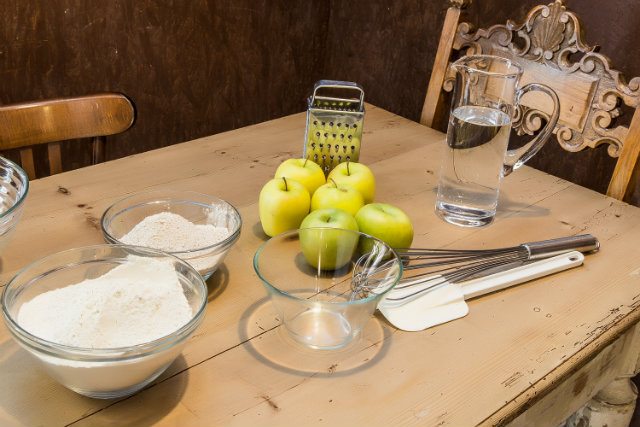
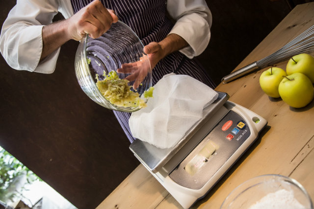
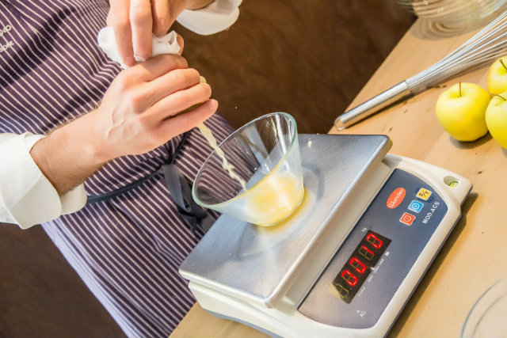
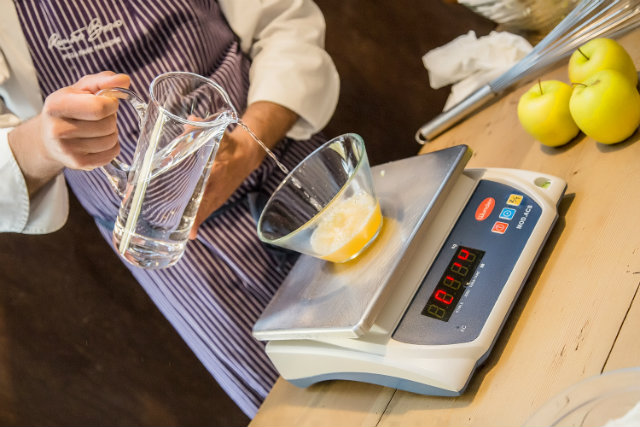
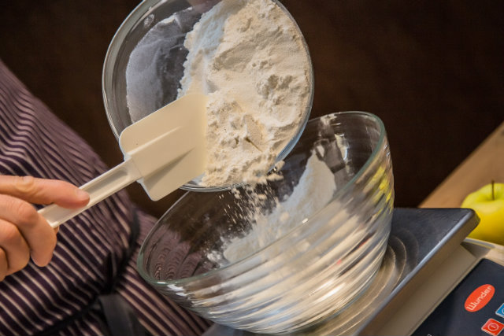
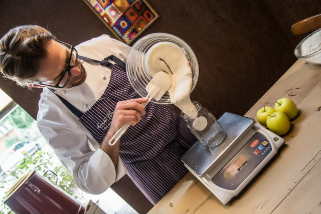
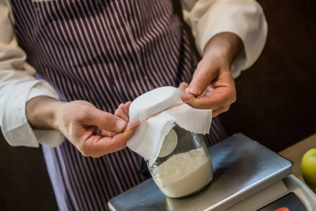
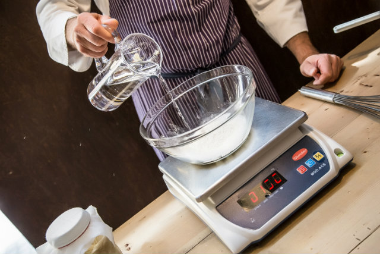
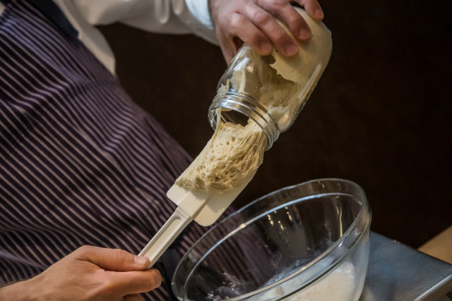

Presente la storia del tallone e di Achille? Il mio tallone d’Achille in cucina è la pasta madre. Per questo mi sono rivolta a Renato Bosco.

Di suo si definisce “pizzaricercatore”, espressione che profuma di pre-impasti e lunghe lievitazioni, studi sulle farine e di gusto, morbidezza, digeribilità. Saporè, il suo locale, è a San Martino Buonalbergo in provincia di Verona. Pizze classiche, alla romana, al taglio, a metro, gourmet, con tanto di spinoff due civici più in là, che poi sarebbe Saporè Asporto.

Da oggi per una serie di episodi approfitteremo del suo talento raro, da fornaio, pizzaiolo, pasticcere e topo da laboratorio bernoccolato per condividere con voi, lettori di Dissapore, i segreti del pane fatto in casa e delle pizza.

Iniziamo con la pasta madre. 

L’accento veronese lo situa geograficamente agli antipodi della verace pizza napoletana, eppure, quando anni fa un pasticcere ha fatto accoppiare Renato con un pezzetto della sua pasta madre sono nati figli superdotati.

Si chiamano crunch, aria di pizza, mozzarella di pane e sono tutti impasti che usa per far pizze da menzione d’onore (come quella che gli danno da tre anni a Identità Golose, il congresso milanese di alta cucina).

Come Paperone con la sua numero 1, anche Renato conserva la sua prima pasta madre (fatta col suo maestro aostano Rolando Morandin), ma col tempo ha elaborato la formula magica per produrla. Al suo manufatto primogenito ha dato anche un nome: pasta madre viva.

“Viva” mi sembrava un po’ affettato, così gliel’ho detto. Mi ha spiegato che l’aggettivo invece è fondamentale, e che serve a differenziare questa piccola creaturina da coccolare dagli altri lieviti “naturali” in commercio, che sono disidratati, e che stanno pazienti nella bustina finché non vi viene il guizzo della pasticceria.

Viva, in effetti, la sua pasta madre lo è anche troppo: va nutrita ogni giorno, protetta dal caldo e dal freddo (io, probabilmente le canterei anche la ninna nanna). Sia come sia, mi ha dato la sua formula magica, che con grande prova di generosità condivido con voi, lettori di Dissapore.

Ingredients
===========

* 100ml di succo di Mela
* 100ml di acqua gassata
* farina 0

Preparation
===========

Si prende una mela, possibilmente biologica, perché bisogna grattugiarla tutta (torsolo, semi e buccia compresi) e poi se ne filtra il succo con una garza. Mentre vedo Renato lavorare penso che a casa avrei usato un miniprimer per frullarla, e poi avrei filtrato il frullato con la garza: io e le grattuge non andiamo d’accordo.

A questo punto viene indispensabile avere sotto mano una bilancia digitale, perché la panificazione, si sa, è lavoro di precisione. Dunque si pesano 100 gr di succo di mela filtrato, e si aggiungono 100 gr di acqua gassata. Va bene quella del super o quella fatta in casa col gasatore.

E’ tempo di aggiungere la farina 0 (per i professionisti e affini deve avere almeno 350 W). 

Poi Renato prende una frusta di quelle che si usano per non far venire i grumi nella polenta, e mescola veloce.

Tutto qui. Ora basta trasferire il composto in una barattolo (quelli della Bormioli da litro sono perfetti) e coprire con una garza. E mentre rimiro la maestria dei gesti di Renato, penso a casa mia e a quanto, e ripeto quanto, avrei sbrodolato pasta madre ovunque. Adesso si deve aspettare, precisamente 24 ore, lasciando il barattolo a temperatura ambiente. 

Dopo il primo giorno la pasta madre avrà dimostrato pienamente di essere viva, e sarà più che raddoppiata.

E’ il momento di strappare via la crosticina che si è formata sopra (Renato lo fa con gesto rapido e gagliardo, che proverò a imitare). Poi si pesano 100 gr di farina (sempre 0) e si uniscono 100 gr di acqua, che questa volta deve essere naturale e calda, a 30 gradi. Alla fine vanno aggiunti anche 100 gr di pasta madre e si usa di nuovo la frusta da polenta.

Detto, fatto. La noiosa operazione del rinfresco dura meno di 5 minuti, e, se uno è abile la metà di Renato (anche un quarto) sporca giusto un paio di ciotole.

Ora si riversa tutto nel barattolo di prima, vuoto e pulito fate attenzione, si rimette sopra quella vezzosa garzetta e si aspetta il nuovo giorno.

Per avere una pasta vivace al punto giusto bisogna attendere 15 giorni prima di usarla per una lievitazione. Va rinfrescata tutti i giorni, con l’accortezza di lasciarla fuori dal frigo solo la prima settimana.

Sappiate che c’è pure la possibilità di panificare solo con la pasta madre, anche solo con quello scarto che eccede i 100 grammi e che ogni giorno dovreste buttar via.

Notes
=====
