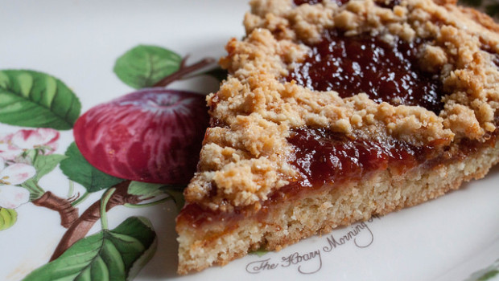

La pasta sablée – in italiano nota anche come ‘sabbiosa’ – è un tipo particolare di pasta che a volte, dato il suo impiego, viene confusa con la frolla, ma in realtà è di questa molto meno calorica anche se più zuccherina, e molto meno friabile. La sua composizione la rende ideale per crostate preparate anche solo con frutta fresca e gelatina, biscotti fragranti e tartellette; il gusto risulterà al palato un po’ più sabbioso (appunto) e si sposa particolarmente bene con confetture a base di frutti di bosco, specialmente fragole, lamponi e mirtilli.

Ingredients
===========

* 300gr di farina
* 120gr di zucchero a velo
* 120gr di burro
* 1 uovo
* 1-2tbsp d’acqua fredda

Preparation
===========

In una ciotola mettete la farina, il burro a pezzetti ancora freddo di frigorifero, lo zucchero a velo e l’uovo, quindi impastate velocemente con le dita: otterrete un impasto a briciole che via via diventa sempre più compatto, magari aggiungendo qualche cucchiaiata di acqua fredda.

Stendete la pasta dopo averla lavorata non molto tempo, in modo che non si scaldi troppo, foderatevi una teglia e infornate a 180° per una ventina di minuti.

Notes
=====
