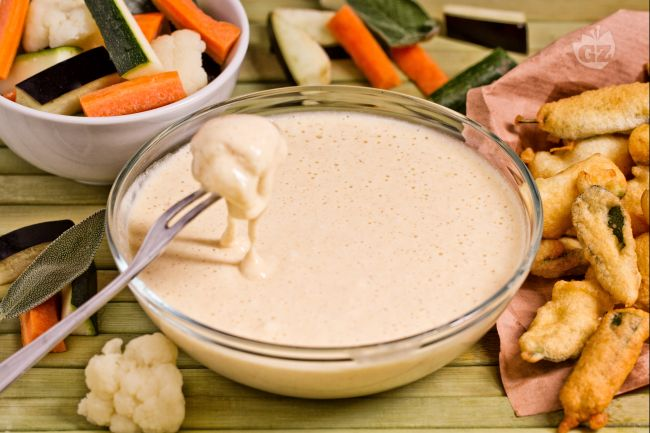

La pastella per fritti è un composto di base molto importante in tutte le culture culinarie per friggere verdura, carne, pesce e altri alimenti.

Esistono diversi tipi di pastelle per fritti, qui vi proponiamo una ricetta che prevede l’utilizzo degli albumi montati a neve che rendono ancora più soffice e leggera la pastella.

Ingredients
===========

Ingredienti per friggere circa 1kg di verdure

* 2 Uova
* 150gr Farina
* 200ml Latte
* Sale q.b.                                                                                                                                   
Preparation
===========

Per preparare la pastella per i fritti iniziate tagliando a piccoli pezzi la verdura che desiderate friggere (carote, cavolfiori, zucchine, melanzane etc.) poi dividete gli albumi dai tuorli, sbattete questi ultimi con una frusta aggiungendo un pizzico di sale. Poi aggiungete il latte freddo sempre mescolando con la frusta e la farina ben setacciata. In ultimo unite gli albumi montati a neve, mescolandoli con una spatola con movimenti delicati dal basso verso l’alto, per non smontarli. La pastella per i fritti è pronta, preparate gli ingredienti che intendete friggere tagliandoli a piccoli pezzetti (nel caso di una frittura di verdura), immergeteli nella pastella e friggeteli in abbondante olio di semi (meglio l’olio di arachide).

Notes
=====
