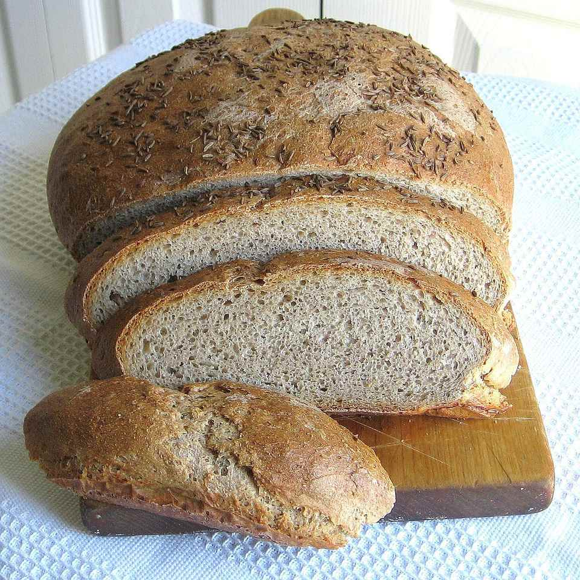

The sourdough starter in this Polish rye bread recipe (loosely translated as chleb na zakwas żytni) gives it a delightful tang, but it takes two days to ripen, so plan accordingly. See the starter shortcut below.

Many people are familiar with white sourdough breads but don't realize some deli ryes are made with a sourdough, too.

Rye breads and wheat breads must be lightened with white flour otherwise, they would be too dense. Brushing with egg white before baking gives this bread a nice shine.

If you have leftovers, put them to good use in these leftover rye bread recipes.

Shortcut: Instead of making a starter, substitute 1 1/2 cups buttermilk and reduce the water in the recipe from 2 1/2 cups to 3/4 cup.

Ingredients
===========

#### For the Sourdough Starter
* 60gr flour (medium rye)
* 70ml milk (warm)

#### For the Bread
* 500gr flour (medium rye)
* 500gr flour (all-purpose)
* 15gr salt
* 1,25gr yeast (instant)
* 30gr butter (softened)
* 750ml water (warm)
* 1 large egg white (room temperature, beaten)
* 15gr caraway (seeds) 

Preparation
===========

#### Make the Starter

In a small bowl, mix together the 4 tablespoons rye flour and milk.
Cover with plastic and set in a warm place to ripen for two days or until it smells pleasantly sour.

#### Make the Dough

In a large bowl, combine 4 cups rye flour and all-purpose flour, salt, yeast, butter, water, and starter. Knead 7 minutes by machine or 10 minutes by hand.
Place in a clean, greased bowl, cover with plastic and let rise in a warm place until doubled, about 1 hour.

Punch down dough, knead 1 minute and divide in half.

#### Shape and Bake

Heat oven to 200°C
Shape each dough half into a round on 2 parchment-lined baking sheets. Cover with oiled plastic and let rise 30 minutes or until almost doubled.
Brush risen rounds with egg white and sprinkle with caraway seeds. Bake 35 to 40 minutes or until instant-read thermometer registers 190 to 195 F and bread sounds hollow when tapped.
Slide breads off baking pans and cool completely on a wire rack.on a wire rack.

Notes
=====

