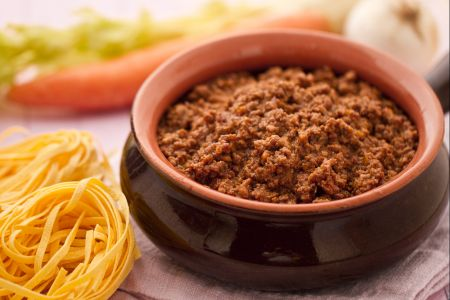

Il ragu’ alla bolognese è un famosissimo condimento tipico dell’Emilia Romagna, a base di carne trita, interpretato in svariati modi, soprattutto per la scelta della carne da utilizzare che, di rimando, condiziona i tempi di cottura del ragu’ stesso.

Esiste, tra le molte versioni, una ricetta ufficiale del ragù alla bolognese, depositata il 17 ottobre 1982 dalla delegazione di Bologna dell'Accademia Italiana della Cucina alla Camera di commercio di questa città, che raccomanda di utilizzare un taglio di carne piuttosto grasso chiamato cartella, posto sulla pancia del bovino.

Oggigiorno, per diminuire l’apporto di grassi nel ragu alla bolognese, spesso, al posto della cartella vengono utilizzati tagli più magri, con i quali si accorciano sensibilmente i tempi di cottura. Anche la pancetta, piuttosto grassa, spesso viene sostituita dalla salsiccia, egualmente saporita ma più magra.

Il giusto accompagnamento per il ragù alla bolognese sono sicuramente le tagliatelle fresche all'uovo, un connubio tutto emiliano, di sicuro successo! Al momento di servire le tagliatelle col ragù, portate in tavola del parmigiano reggiano grattugiato, in modo che i vostri commensali possano spolverizzarlo sulla pasta a piacere.

Ingredients
===========

* 250gr carne di suino tritata (coscia)
* 100gr pancetta dolce tesa o arrotolata
* 1 Carota
* 1 Cipolla media
* 1 gambo di Sedano
* 3tbsp Olio di Oliva Extravergine
* 50g Burro
* 1 bicchiere di Vino Rosso
* 1 bicchiere di Latte
* Sale q.b.
* Pepe macinato
* 250ml Brodo di Carne
* 30gr concentrato di Pomodori
* 250gr Carne bovina trita (cartella, copertina o fesone, girello di spalla)

Preparation
===========

Il primo passo per la preparazione del ragù alla bolognese consiste nel pelare la cipolla e la carota, togliete poi i filamenti al sedano e tritate i 3 ingredienti finemente al coltello oppure utilizzando un mixer. In tegame dai bordi alti, ponete l’olio d’oliva e il burro e scaldate a fuoco basso poi, una volta sciolto il burro, aggiungete il trito di verdure: la cipolla, le carote e il sedano, lasciatele imbiondire mescolando.

Nel frattempo tritate la pancetta finemente e poi aggiungetela  al resto della carne trita e versate il tutto in pentola e lasciate soffriggere fino a che la carne non sia diventata bella rosolata, mescolando di tanto in tanto. Aggiungete quindi il vino rosso e lasciatelo sfumare,  aggiustate di sale e pepe unite il brodo di carne a poco a poco (10) il ragù deve assorbire il brodo (11) ma non deve risultare troppo asciutto (per preparae il brodo di carne consultate la ricetta Brodo di carne cliccando qui). Sciogliete il triplo concentrato di pomodoro in poco brodo (12) e unitelo alla carne (13); mescolate (14) e lasciate cuocere il ragù per circa un’ora e mezza a fuoco lento, aggiungendo, ogni qualvolta serva  e poco alla volta, il brodo residuo e poi, infine, il latte. Quando il ragù sarà pronto (15), aggiustate di sale e pepate a piacere se necessario.

Notes
=====

Conservate il ragù alla bolognese in frigorifero, chiuso in un contenitore ermetico, per 2-3 giorni al massimo.

E' possibile congelare il ragù alla bolognese.
