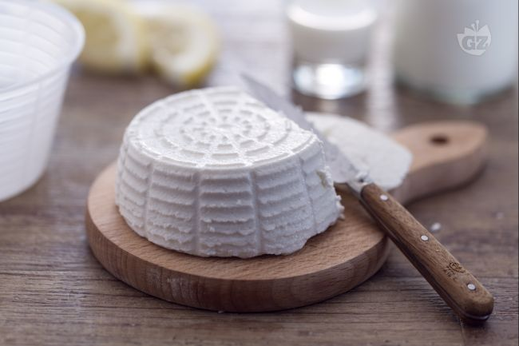

La ricotta è un prodotto latteo molto simile al formaggio; ampiamente usato nella cucina italiana per preparazioni sia dolci sia salate, la qualità della ricotta dipende della qualità del latte con cui viene realizzata e della sua freschezza.

La ricotta fatta in casa è facile e veloce. Il realtà, volendo parlare con proprietà, il prodotto che risulta da questa preparazione si chiamerebbe cagliata. La ricotta così come la conosciamo si prepara con il siero del latte che viene ri-cotto. Questa preparazione è una soluzione fai-da-te molto simile alla ricotta e, bisogna dirlo, anche molto buona! Si può mangiare semplicemente con dello zucchero oppure con del miele. Provate a farlo, vi sorprenderà il risultato.
This would be the description of the recipe. Any info or history about the recipe goes here

Ingredients
===========

Per una ricotta da 200gr:

* 1L Latte
* succo di 1/2 Limone filtrato

Preparation
===========

Per preparare la ricotta, in un pentolino potete a scaldare il latte: dovrete portarlo ad una temperatura di 45° misurandola con un termometro per alimenti. Intanto spremete il succo di 1 limone e filtratelo, quando il latte avrà raggiunto i 45° toglietelo dal fuoco, e versate nel tegame il succo, mescolate qualche secondo con una frusta e coprite con un coperchio. Dopo 10 minuti, rompete la cagliata che si sarà formata con un cucchiaio di legno o con la frusta.

Attendete qualche minuto, poi iniziate a versare un mestolo di cagliata in un colino posto sopra ad una ciotola per raccogliere il siero. Lasciate scolare la cagliata qualche secondo e trasferitela scolata in una fascella da ricotta. Continuate in questo modo fino ad esaurire la cagliata. Una volta riempita completamente, ponete la fascella a scolare sul colino, coprite con un canovaccio e mettete in frigorifero per circa 3 ore. La vostra ricotta sarà pronta non appena comincerà a solidificarsi nella fascella.                

Notes
=====

Conservate la ricotta in frigorifero nella fascella chiuda in un sacchetto per alimenti per 3-4 giorni.

Si sconsiglia la congelazione.   

Il succo di limone si usa per ottenere una versione vegetariana di questo formaggio semplicissimo; per evitare il retrogusto di limone se non lo gradite, potete ovviare utilizzando 20 gr di aceto di mele (che ha un sapore un po’ più delicato) oppure, potete acquistare in farmacia il caglio di origine animale.
