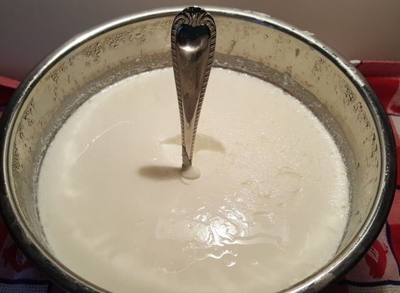

Lo yogurt greco ha una marcia in più rispetto al classico, ovvero la consistenza decisamente più compatta, che lo rende un simil formaggio molle, un po' come il philadelphia. Ha un costo maggiore rispetto allo yogurt "normale" ma è indubbio si presti ad allietare colazioni e merende ed a costituire un ingrediente versatile di numerose preparazioni.

Trattandosi, in sostanza, di uno yogurt filtrato, viene da sè possa essere realizzato in casa: seguite le istruzioni sottostanti per prepararlo senza alcuna difficoltà ed in poche mosse, con la ricetta economica. Questa può essere realizzata a partire da uno yogurt confezionato per andare sul sicuro, specie nel caso in cui si sia alle prime armi.

Ingredients
===========

* 500gr di Yogurt bianco

Preparation
===========

Predisporre una ciotola sulla quale poggiare un colino metallico facendo in modo che non tocchi con il fondo. Rivestirlo con un canovaccio da cucina perfettamente pulito. Versarvi lo yogurt, strizzare leggermente stringendo i lembi del canovaccio e porre il tutto in frigo, all'interno del quale dovrà restare almeno 3-4 ore o meglio tutta la notte. Prolungare il riposo a seconda della consistenza si voglia ottenere. A questo punto prelevare lo yogurt dal canovaccio e conservarlo in un contenitore apposito. Dolcificare a piacere con miele o zucchero ed arricchire con frutta fresca o secca.

Notes
=====
