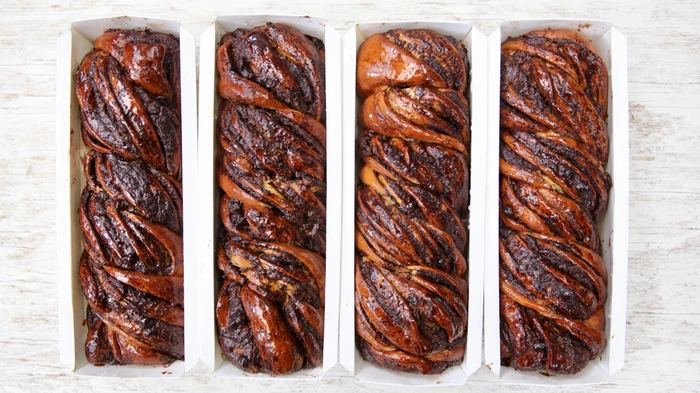

For 4 babkas.

Ingredients
===========

for the dough:

* 170gr whole milk
* 30gr fresh yeast
* 325gr bread flour, sifted
* 325gr pastry flour, sifted
* 2 large eggs, at room temperature
* 110gr granulated sugar
* 1/2tsp vanilla extract
* 1/4tsp salt
* 120gr unsalted butter, at room temperature, cut into cubes

for the chocolate filling:

* 450gr Nutella
* 200gr bittersweet chocolate chips

for the sugar syrup:

* 160gr granulated white sugar
* 120gr water

Preparation
===========

1. Pour the milk into the bowl of a stand mixer fitted with the dough hook. Break up the yeast into the milk and dissolve it into the milk with a whisk or using your fingertips. Dump the flour on top of the milk, then the eggs on top of the flour, then the sugar, then the vanilla, then the salt, then half of the butter. Begin mixing at the lowest speed. After 2 minutes increase the speed to medium and continue mixing for another 5 minutes, scraping down the bowl, if necessary, so that it all mixes together. The dough should begin to come together but won’t be smooth.

2. Reduce the mixer speed to low and slowly add the rest of the butter, cube by cube, only adding more butter once the previous cube disappears into the dough. This process should take 2 to 3 minutes. Once all of the butter is incorporated, turn off the mixer. The dough should be smooth and elastic.

3. Lightly flour a work surface with bread flour, and turn the dough out onto the floured surface. Knead the dough into a smooth ball.

4. Form the dough into a rectangle (measuring about 10 inches by 6 inches) and place on a tray. Cover with plastic wrap and refrigerate for at least 2 hours but up to 12 hours.

5. Lightly grease four 8 1/2-inch-by-4 1/2-inch loaf pans with nonstick baking spray. Lightly flour a work surface with bread flour, and transfer the dough to the floured surface. Lightly flour a rolling pin and roll the dough into a rectangle measuring about 36 inches by 9 inches—it’s fine if the rectangle is bigger (up to 40 inches by 12 inches) but no smaller than 36 inches by 9 inches. If the dough shrinks back as you roll it out, cover it with a towel or plastic wrap for 5 minutes to let it rest and then continue rolling again.

6. Using an offset spatula, spread the Nutella evenly out onto the dough, spreading it out to all of the edges. Sprinkle the chocolate chips evenly out over the Nutella.

7. Place the dough in front of you with the long, 36-inch side towards you. Starting from the lower left side of the dough, use your fingertips to roll the dough, working your way from the left side to the right side and using your fingertips to the roll the dough into a roulade as tightly as possible. The tighter the roulade is rolled, the more layers of chocolate the babka will have. Once you’ve rolled the dough, gently pull the roulade so that it reaches about 48 to 50 inches in length. Using a serrated knife, cut the roulade in half lengthwise, along its 36-inch length. Cut the dough crosswise into 4 even pieces. You should now have 8 roulade halves in 4 pairs of 2. Place one of the pieces cut-side up. Place another piece on top (also with the cut-side up) to make an X with the two pieces. Twist the two halves around each other, gently pulling the dough to wrap the two pieces around each other. This is what gives the babka its telltale braided characteristic. Transfer the babka to one of the loaf pans and repeat this process with the remaining 6 roulade halves to make 4 babkas in total.

8. Cover the babkas with a towel or place in a clean plastic bag to cover completely. Set in a warm place until doubled in size, 2 to 2 1/2 hours. In the meantime, make the sugar syrup. Combine the sugar and water in a small saucepan over medium-high heat. Bring to a boil and simmer for 2 minutes. The sugar should be completely dissolved. Remove from the heat and set aside to cool.

9. Heat the oven to 180°C. Bake the babkas for 25 minutes in a convection oven or 30 minutes in a regular oven. Once they’re done baking, the babkas should be golden brown.

10. Remove from the oven and immediately brush generously with the sugar syrup. You should still have about a quarter of the syrup leftover after brushing the babkas. You can refrigerate the syrup for up to a week and reserve it for a later use.

11. Let the babkas cool completely at room temperature before turning them out from their loaf pans. 

Notes
=====
