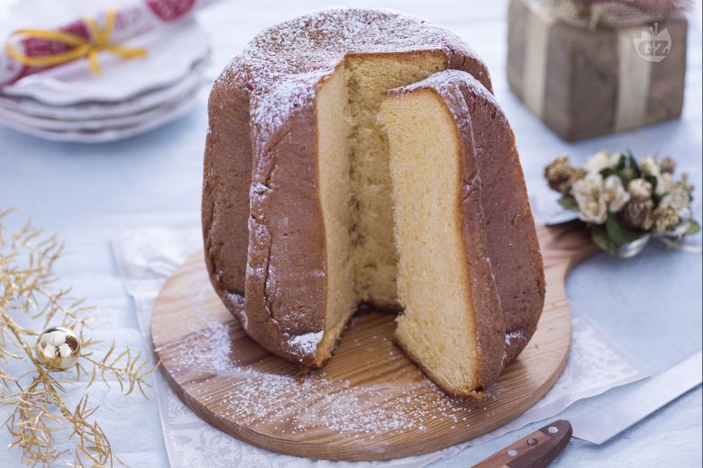

Il pandoro è insieme al panettone uno dei dolci tradizionali natalizi che non può assolutamente mancare tra le ricette delle feste. Nella nostra ricetta vi presentiamo un pandoro preparato con il lievito madre, ovvero un impasto fermentato in cui si sviluppano batteri e fermenti lattici che favoriscono la lievitazione naturale. Il lievito madre può essere utilizzato al posto del lievito di birra fresco o disidratato nella preparazione di lievitati dolci e salati, conferendo un aroma più caratteristico all'impasto. L'impiego della lievitazione naturale porta ad un allungamento delle tempistiche di riposo perchè gli impasti possano lievitare a dovere prima di essere infornati: per realizzare il pandoro è quindi necessario rispettare i diversi tempi di lievitazione e aggiungere gli ingredienti nell'ordine poco alla volta. Il dolce risultato finale non vi deluderà e vi ripagherà dei vostri sforzi: un buon pandoro preparato con le proprie mani è proprio quello che vi serve per stupire i vostri commensali!

Ingredients
===========

## For first dough

* 70gr Zucchero
* 100gr Tuorli (4)
* 80gr Lievito madre
* 160gr Farina
* 45gr Acqua
* 80gr Burro (a temperatura ambiente)

## For second dough

* 100gr Farina

## For the emulsion

* 15gr zucchero
* 15gr miele
* 70gr burro
* 20gr tuorli (1)
* 1 pizzico sale fino

Preparation
===========

Per preparare il pandoro con lievito madre nella ciotola di una planetaria munita di gancio versate l'acqua, il lievito madre tagliato a pezzetti, lo zucchero e il lievito.

Separate 4 tuorli del peso di 80gr dagli albumi (con questi ultimi potete preparare delle meringhe o delle lingue di gatto), aggiungete al composto poco alla volta i tuorli e azionate la planetaria. Dopo 2-3 minuti versate la farina e continuate fino a quando l'impasto non si sarà incordato al gancio.

A questo punto aggiungete il restante tuorlo del peso di 20gr e proseguite col gancio fino a quando si sarà incordato nuovamente. Aggiungete poco alla volta il burro a temperatura ambiente tagliato a cubetti, aspettando che venga ben assorbito prima di aggiungere la parte successiva. Una volta che l'impasto si sarà incordato, spegnete la planetaria e con l'aiuto di un tarocco trasferitelo in un contenitore capiente; coprite con un canovaccio asciutto e mettete a lievitare per 12-13 ore in un luogo alla temperatura di 25-29°. Trascorso il tempo necessario, l'impasto avrà triplicato il suo volume; ponete l'impasto che avete ottenuto nella planetaria e versate poco alla volta la seconda dose di farina di 80gr, aspettando che si incorpori al composto prima di versare la dose successiva. Nel frattempo, preparate l'emulsione: fate fondere il burro (in microonde o a bagnomaria) poi in una ciotola a parte versate un tuorlo e lo zucchero, mescolando bene con una spatola.

Aggiungete il sale, il miele e il burro fuso, amalgamando bene tutti gli ingredienti.

Quando la farina si sarà ben incorporata, aggiungete all'impasto l'emulsione a base di uova che avete preparato, continuando fino a quando il composto si incorderà al gancio.

Lavorate l'impasto leggermente in modo da piegarlo all’interno e chiudere la base, conferendo una forma tondeggiante; imburrate uno stampo da pandoro del diametro di 25cm e del peso di 750gr e adagiatevi l’impasto lasciando la superficie più tonda e liscia rivolta verso l'alto.

Coprite nuovamente con un canovaccio asciutto e lasciate lievitare per almeno 12 ore sempre in un luogo a temperatura ambiente: trascorso questo tempo, l'impasto dovrà raggiungere quasi il bordo dello stampo; fate cuocere in forno statico preriscaldato a 180° per circa 55 minuti (a 160° per 45 minuti se in forno ventilato). Quando il pandoro sarà ben dorato, sfornatelo e capovolgetelo su un piatto da portata, facendolo raffreddare completamente prima di estrarlo dallo stampo. Infine potete servire il vostro pandoro con lievito madre, terminando con una spolverizzata di zucchero a velo a piacere.
Notes
=====

Si consiglia di conservare il pandoro con lievito madre per al massimo 3-4 giorni sotto una campana di vetro. E' possibile congelare l'impasto direttamente nello stampo prima dell'ultima lievitazione, e poi scongelarlo a temperatura ambiente.

Se vedete che il pandoro verso metà cottura risulterà troppo colorato, copritelo con un foglio di alluminio e portate a fine cottura.
