Dosi per 2 panettoni da 1 kg l’uno. Se volete realizzarne solo 1 da un chilo, dimezzate le dosi!

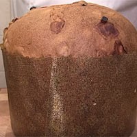

Il Panettone, come il Pandoro, è un dolce della nostra tradizione italiana che non può assolutamente mancare sulle tavole degli italiani durante le feste natalizie.

Anche se la preparazione è molto laboriosa, il risultato finale sarà garantito. Prima di cominciare la preparazione del panettone, nell’arco della giornata dovete rinfrescare il lievito madre per tre volte, ogni 4 ore, con un livello di idratazione del 60% dopodiché potrete procedere.

Ingredients
===========

#### 1° Rinfresco

* 100gr lievito madre
* 100gr farina manitoba
* 60ml acqua

### 2° Rinfresco

* lievito madre rinfrescato
* 100gr farina manitoba
* 60ml acqua

### 3° Rinfresco

* lievito madre rinfrescato
* 100gr farina manitoba
* 60ml acqua

### 1° Impasto

* 180gr lievito madre rinfrescato
* 2 uova
* 6 tuorli d'uovo
* 440gr farina manitoba
* 140ml latte
* 120gr zucchero
* 80gr burro
* 10gr malto

### 2° Impasto

* 300gr farina manitoba
* 120gr uovo battuto
* 140gr zucchero
* 1 bacca di vaniglia
* 1 scorza di arancia
* 1 scorza di mezzo limone
* 120gr burro
* 150gr canditi
* 150gr uvetta sultanina
* sale

### Per la conservazione

* 20/25ml alcol 96°

Preparation
===========

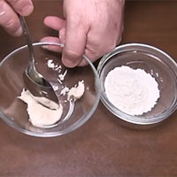
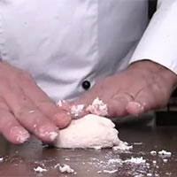

Cominciate, intorno alle 8 di mattina preferibilmente per avere tempo sufficiente, a tirare fuori dal frigorifero il lievito madre e lasciatelo a temperatura ambiente per 2 ore. Quindi prelevatene 100 gr e mettetelo in una ciotola, quindi aggiungete dapprima 60 ml di acqua per addolcirlo e mescolate con un cucchiaio. Quando inizierà a sciogliersi, aggiungete 100 gr di farina manitoba, quindi impastate il tutto manualmente sopra un tavolo da lavoro e quando il lievitino risulterà liscio ed omogeneo, rimettetelo nella ciotola e fatelo riposare per 4 ore.

Secondo rinfresco: dopo 4 ore ripetete lo stesso procedimento, al lievito aggiungete 60 ml di acqua, fate sciogliere, quindi aggiungete 100 gr di farina manitoba, impastare manualmente e mettere nella ciotola a riposare per altre 4 ore.

Terzo e ultimo rinfresco: ripetere lo stesso procedimento aggiungendo 60 ml di acqua e 100 gr di farina manitoba. Fate riposare per altre 4 ore, dopodiché è pronto per cominciare la preparazione.

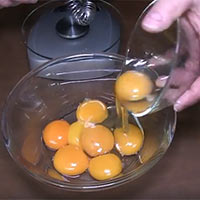
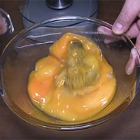
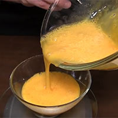

In una ciotola unite i tuorli e le uova intere, sbattete con una frusta, dopodiché pesate il composto su una bilancia da cucina (il peso delle uova è fondamentale). Il totale delle uova deve essere 240 gr (se il peso è inferiore, aggiungete un tuorlo, se è superiore togliete l’eccedenza).

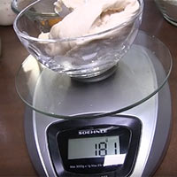
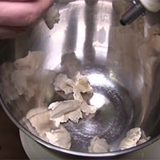

Poi dividete a metà l’uovo sbattuto in due ciotole, ognuna del peso di 120 gr. Quindi una ciotola la utilizzerete subito, mentre l’altra la coprite con pellicola trasparente e la ponete in frigorifero per il secondo impasto.

Spezzettate 180 gr di lievito madre rinfrescato in una planetaria.

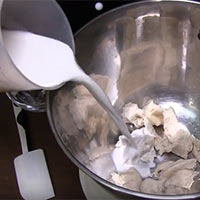
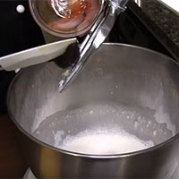
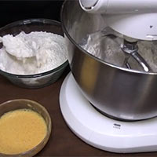

Quindi aggiungete 140 ml di latte e avviate la macchina. Impastate per 3 o 4 minuti fino a che non si forma una schiuma, in questa fase utilizzare la foglia e non il gancio.

Aggiungete, dunque, il malto (se utilizzerete quello in polvere e non quello liquido, aggiungete 1 cucchiaio di miele) e, un cucchiaio alla volta anche tutta quanta la farina (in questa fase di lavorazione si formerà la maglia del glutine, ossia la struttura che terrà in piedi il panettone), quindi mescolate per altri 4-5 minuti fino a che la farina non sia perfettamente assorbita all’impasto.

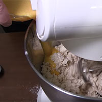
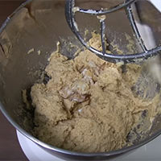

Dopodiché inserite anche tutto lo zucchero (120 gr) e, poco alla volta, anche i 120 gr di uovo battuto (in questa fase l’impasto sarà liquido e appiccicoso). Continuate ad impastare per altri 10 minuti finché l’impasto non si incordi nuovamente.

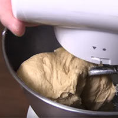
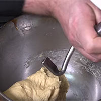

Nel frattempo fate sciogliere il burro (80 gr) nel microonde per circa 30 secondi, quindi mescolatelo bene con un cucchiaio e lasciatelo raffreddare a temperatura ambiente per 10 minuti. Se vedete che l’impasto fa fatica ad incordarsi, aumentate la velocità della planetaria, finché non si staccherà bene dalle pareti e rimarrà attaccato alla foglia. Quindi. Arrivati a questo punto, sostituite la foglia con il gancio ed impastate per 4 o 5 minuti.

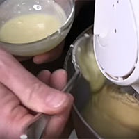
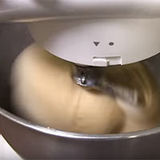
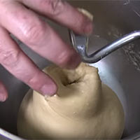

Aggiungete, dunque, il burro fuso continuando ad impastare, finché non sarà ben assorbito all’impasto. Ci vorranno all’incirca 10 minuti. Non vi preoccupate se l’impasto torna liquido e appiccicoso, è tutto normale! Dopo 10 minuti vedrete che l’impasto avrà assorbito perfettamente il burro. Quindi abbassate la velocità della planetaria e continuate ad impastare per altri 5 minuti. Quando l’impasto si staccherà bene dal gancio è pronto per la fase successiva , altrimenti continuate ad impastare ancora per qualche minuto.

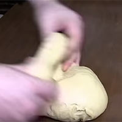
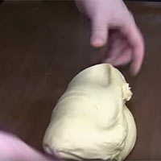
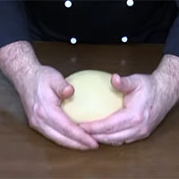

Versate l’impasto sopra un tavolo da lavoro e iniziate una sorta di pirlatura, rigirandolo su se stesso per 3 o 4 volte, in modo da dargli un po’ di forza. Quindi formate una palla e mettetelo in una ciotola.

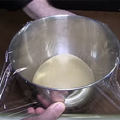
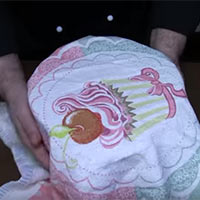
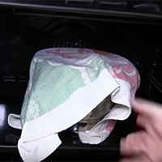

Coprite con un foglio di pellicola trasparente e un canovaccio, quindi mettete l’impasto a lievitare nel forno spento per tutta la notte, circa 12 ore, fino a raddoppiare il proprio volume.

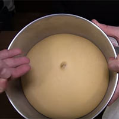
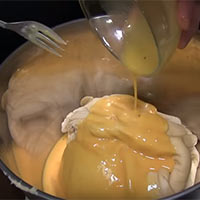
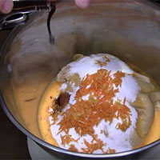

Dopo 12 ore l’impasto avrà raddoppiato il proprio volume, quindi rimettetelo nella planetaria e aggiungete 120 gr di uovo battuto, lo zucchero (140 gr), la scorza grattugiata di un’arancia e la scorza grattugiata di mezzo limone, 1 cucchiaino di essenza di vaniglia o la polpa di una bacca di vaniglia, un pizzico di sale e 300 gr di farina, quindi avviate la macchina con il gancio e cominciate ad impastare per circa 10 minuti.

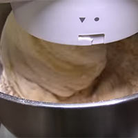
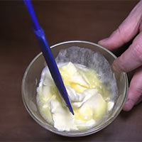
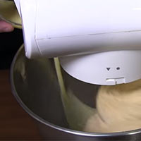

Nel frattempo fate sciogliere il burro (120 gr) nel microonde per circa 30 secondi, quindi mescolatelo bene con un cucchiaio e lasciatelo raffreddare a temperatura ambiente per 10 minuti. Quando tutti gli ingredienti si saranno assorbiti all’impasto, aggiungete il burro fuso continuando ad impastare per circa 10 minuti, esattamente come nella fase precedente.

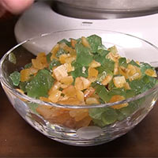
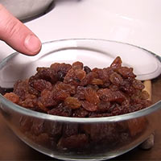
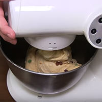

Quando il burro sarà completamente assorbito all’impasto, aggiungete i canditi e l’uvetta non ammorbidita, e continuate ad impastare (vi raccomando in questa fase di impastare a bassa velocità, altrimenti si rischierebbe di rompere la maglia del glutine. Un’altra raccomandazione, se volete aggiungere le gocce di cioccolato al posto di uvetta e canditi, lasciatele nel freezer mezz’ora prima di aggiungerle all’impasto e impastate al massimo per 30 secondi, altrimenti se le gocce di cioccolato si sciolgono in questa fase, pregiudicano l’impasto e non lievita più).

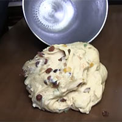
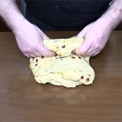
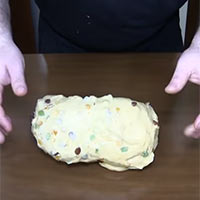

Versate l’impasto sopra un tavolo da lavoro, rigiratelo su se stesso per 3 0 4 volte.

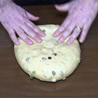
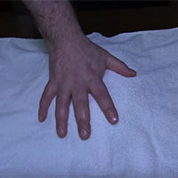
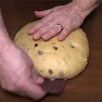

Quindi formate una palla, schiacciatela leggermente, coprite con un canovaccio e fate riposare per 1 ora.

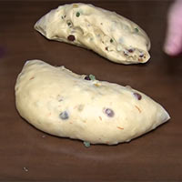
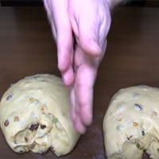
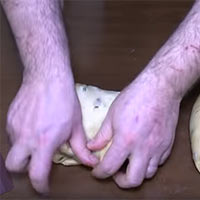

Dopo un’ora dividete l’impasto a metà, poiché i panettoni sono due, dopodiché iniziate la fase di pirlatura: ungetevi bene i palmi delle mani con una noce di burro.

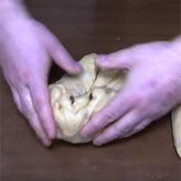
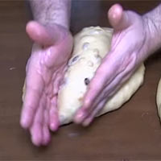

Quindi ripiegate l’impasto verso la parte interna, aiutandovi con i pollici, per 4 o 5 volte, quindi con le mani sporche di burro, schiacciate l’estremità dell’impasto e giratelo tra le mani, cercando di stirarlo il più possibile(la parte esterna dell’impasto deve essere ben tesa).

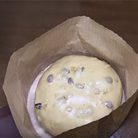
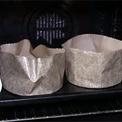
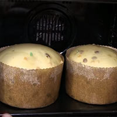

Fate lo stesso anche con il secondo impasto. dopodiché metteteli negli stampi da panettone pressandoli un po’ e metteteli a lievitare nel forno spento fino a che l’impasto raggiungerà il bordo dello stampo. Ci vorrà molto tempo, anche 24 ore.

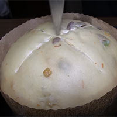
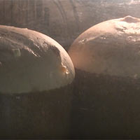
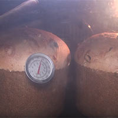

Passato il tempo, tirate i panettoni fuori dal forno e con la lama di un coltello ben affilata formate un taglio a croce sulla superficie, quindi mettete un pezzetto di burro in mezzo alla croce in modo che non si secchino durante la cottura.

Preriscaldate il forno a 200°C, quindi infornate i panettoni e abbassate subito la temperatura del forno a 180°. Fate cuocere i panettoni a 180°C per i primi 10 minuti, dopodiché abbassate la temperatura a 170°C e proseguite la cottura per altri 20 minuti. Quindi abbassate ulteriormente la temperatura del forno a 150°C e fate cuocere per gli ultimi 15 minuti. Se avete un termometro a sonda, negli ultimi 5 minuti di cottura inseritelo nel cuore del panettone per verificarne la temperatura. Quando raggiungerà la temperatura di 95°C, è perfettamente cotto, quindi spegnere immediatamente il forno. Sfornate i panettoni ed infilzate delle pinze o due ferri da maglia nella parte centrale del panettone, quindi capovolgeteli nelle pentole e lasciateli a testa in giù per 5 o 6 ore, in maniera che fuoriesca tutta l’umidità. Dopodiché tirate fuori dalle pentole i panettoni, rigirateli e privateli delle pinze.

Per conservare i panettoni e per mantenere soffice e morbida la parte superiore che è rimasta a contatto con l’aria, è necessario nebulizzarli con dell’alcool puro a 96° (quello che utilizzate per fare i liquori). Quindi mettete un pochino di alcol in uno spray e nebulizzate i panettoni. Dopodiché mettete i panettoni all’interno dei sacchetti e prima di chiuderli spruzzategli altro alcool in maniera che rimangono fragranti per più giorni.

I panettoni con il lievito madre sono pronti, ma bisognerà aspettare altre 24 ore prima di poterli mangiare!

Notes
=====

This recipe calls for a medium/large pan to bake the panettone. If it's quite small, like mine, reducing a quarter all the ingredients will better fit into it.
