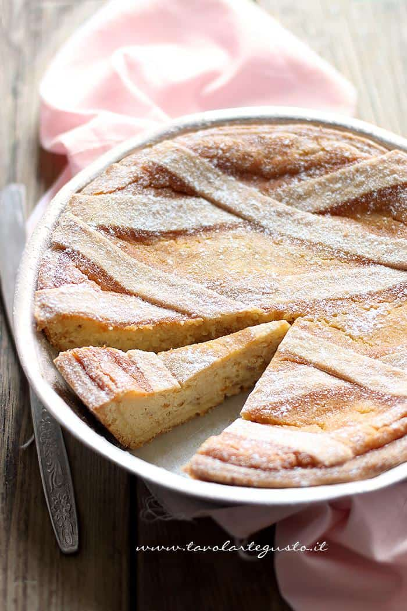

La Pastiera napoletana è un dolce della tradizione partenopea, tipico del periodo pasquale, a base di pasta frolla, grano, ricotta, uova e dal profumo intenso di fiori d’arancio. 

Di seguito, una piccola guida, che va dalla scelta degli ingredienti fino alla metodica di cottura, il tutto spiegato nei minimi dettagli, trucchi e segreti passo passo, per preparare in casa una pastiera napoletana perfetta, secondo la ricetta originale, che non ha niente da invidiare a quelle delle pasticcerie più accreditate e credetemi, seguendo tutte le indicazioni con attenzione risulterà anche semplice da eseguire!

Ingredients
===========

Quantità per 1 pastiera diametro 28 – 30 cm

Per la pasta frolla:

* 330gr di farina + 6-7gr per la spianatoia
* 165gr di burro morbido a temperatura ambiente
* 130gr di zucchero semolato
* 1 uovo medio
* 2 tuorli piccoli
* la punta di 1 cucchiaino di lievito
* 1tsp raso di aroma di fiori d’arancio se utilizzate quello diluito; 2 gocce se state usando quello concentrato
buccia grattugiata di 1 limone
* 1 pizzico di sale

Per crema di ricotta:

* 350gr di ricotta di pecora perfettamente sgocciolata
* 300gr di zucchero
* 1 uovo
* 1/2tsp di cannella
* 4tbsp di aroma di fiori d’arancio se utilizzate quello diluito; 1 cucchiaio se state usando quello concentrato
* 70gr di canditi misti

Per crema di grano:

* 300gr di grano cotto per pastiere
* 200gr di latte intero fresco
* buccia intera di 1 arancia
* buccia intera di 1 limone
* 25gr di burro

Preparation
===========

#### Pasta Frolla

Almeno 12 h prima (meglio se 24 h prima) preparate la frolla.

La frolla per pastiera, è diversa dalle solite frolle, dev’essere un guscio resistente e non troppo friabile altrimenti in cottura, sopratutto quando la pastiera tenderà a gonfiarsi, si romperanno le strisce decorative, inoltre con una frolla troppo friabile la fetta tenderà a spaccarsi.

Montate con l’aiuto delle fruste elettriche o la planetaria,  il burro morbido con lo zucchero , la buccia di limone e l’aroma di fiori d’arancio  per almeno 3- 4 minuti fino ad ottenere un composto cremoso.

Aggiungete sempre montando a velocità alta l’uovo e poi i tuorli, uno alla volta, aspettando che il primo si assorba, prima di inserire il secondo, fino ad ottenere una crema liscia, omogenea e priva di grumi, infine aggiungete un pizzico di sale.

A questo punto inserite la farina in un sol colpo precedentemente setacciata con il lievito e girate a mano con una spatola, in poche mosse la frolla si compatterà, pur rimanendo molto morbida.

Trasferite su una spianatoia e impastate poco, il tempo di amalgamare tutti gli ingredienti insieme, attaccherà un pochino alle mani, così dev’essere, aggiungete altri 6-7 gr di farina per compattare e formare una palla.

Sigillate la vostra pasta frolla per pastiera in una pellicola, appiattite e lasciate in frigo per un circa 12 h (meglio 24 h prima).

#### Ricotta con zucchero

Sempre almeno 12 h prima (meglio 24 h prima) di procedere: sgocciolate perfettamente la ricotta, strizzandola più volte in un strofinaccio di cotone; unitela allo zucchero, girate bene e lasciate marinare in una ciotola coperta da una pellicola. Anche in questo caso la marinatura è fondamentale la ricotta deve assorbire lo zucchero completamente e quest’ultimo deve sciogliersi, diventando tutt’uno con il composto.

#### Crema di Grano

Il giorno della realizzazione della pastiera napoletana, procedete prima di tutto a preparare la crema di grano.

Ricavate dagli agrumi delle bucce piuttosto spesse, serviranno tutte, quindi non lasciate pezzi sui frutti.

Disponete in un pentolino basso e di media grandezza (non troppo piccolo, il grano è bene che stia largo e disteso) il grano, il latte, il burro e tutte le bucce degli agrumi. Ponete su fuoco bassissimo e cuocete per 25 – 30 minuti girando di continuo.

Al termine del tempo indicato, dovrete aver ottenuto una crema vellutata. A questo punto eliminate le bucce degli agrumi, avendo cura di ripulirle bene e di non lasciare attaccata la crema e non sprecare quindi l’impasto.

Prelevate 100 gr di crema di grano e frullatela.

Quest’operazione è necessaria, per rendere ancora più cremoso il composto finale. E’ possibile frullarne anche 150 gr ma non di più, i chicchi di grano devono comunque essere presenti nella vostra pastiera. A questo punto unite la crema frullata a quella precedente e lasciate raffreddare completamente.

#### Crema di Ricotta

Setacciate la ricotta, con un colino a fori stretti. Setacciare la ricotta è un’operazione noiosa ma indispensabile. La crema di ricotta dev’essere liscia, setosa e cremosa priva assolutamente di grumi e pezzetti. Dunque pazienza, schiacciate bene al fine di non sprecare nemmeno un pò di impasto.

Alla ricotta setacciata, aggiungete la cannella, girate bene, poi amalgamate l'uovo e infine aggiungete i cucchiai di aroma di fiori d’arancio.

Il composto finale si presenterà come una crema liscia e piuttosto morbida. A questo punto sminuzzate i canditi. Io li preferisco molto piccoli, voi potete anche lasciarli più grandi. Quando la crema di grano è perfettamente fredda, aggiungetela alla crema di ricotta e infine aggiungete i canditi, girate bene.

il ripieno della vostra pastiera è pronto. Coprite il ripieno con una pellicola e ponetelo in frigo.

#### Assemblare la Pastiera

Spolverate bene di farina il vostro piano di lavoro e stendete la frolla (ormai fredda e dura) ad uno spessore di circa 4 mm circa , avvolgete la sfoglia sul matterello e adagiatela sul vostro stampo per pastiera precedentemente imburrato e infarinato.

Con l’aiuto di un matterello appiattite i bordi della superficie per tagliare via l’impasto in eccesso. Con un coltello a lama affilata ritagliate i bordi a filo con lo stampo  e bucherellate il fondo con i rebbi di una forchetta. Ponete il guscio di frolla  in frigo e stendete gli sfridi di impasto per ricavare le strisce.

Attenzione! se avete realizzato il guscio velocemente, gli sfridi di pasta frolla saranno ancora freddi e dunque sarà semplice tagliarli perfettamente.Se invece avete messo più tempo e si sono riscaldati ponete in freezer per 10 minuti e procedete a stendere l’impasto.

Stendete l’impasto ad uno spessore di circa 3-4 mm e ricavate delle strisce  (6-8 a seconda della dimensione dello stampo ) della larghezza di 1 cm /1,2 cm massimo 1,5 cm con l’aiuto di un taglia pasta liscio oppure di un coltello se avete la mano ferma, altrimenti meglio la rotella. A questo punto tirate fuori il ripieno dal frigo , versatelo nella tortiera lasciando 6 -7 mm di spazio dal bordo.

#### Decorare la Pastiera

Adagiate le prime 3 o 4 strisce sulla pastiera, ad una distanza uguale di circa 4 cm. Adagiate infine le altre strisce incrociandole alle precedenti, in modo che si formino dei rombi. Una volta aggiunte tutte le strisce, tagliatele con un coltello nei pressi del bordo, facendo attenzione a lasciare un piccolo margine e non tagliare troppo. Sigillatele pinzando gli estremi delle strisce sui bordi. A questo punto la vostra pastiera è pronta per essere cotta.

#### Cottura della Pastiera

Per evitare che si gonfi troppo, tenete la pastiera in frigo un paio d’ore prima della cottura

La pastiera, va cotta a lungo e lentamente, in primis perché la cottura dolce favorirà un ripieno cotto e una frolla dorata e non bruciata, in secondo luogo perchè una cottura lenta e tenue garantirà un sapore migliore, e non di uovo cotto (sapore tipico delle alte temperature).

Cuocete in forno già caldo nella parte medio bassa a 150° per 1 h e 45′ – 50′ circa.

Dopo 1 h controllate la situazione, e’ possibile che la pastiera si gonfi, niente paura, aprite leggermente il forno e  richiudete.

Negli ultimi 15 minuti controllate il colore della vostra pastiera, doverà essere caramellata – ambrata,  se è un pò pallida, trasferitela al piano medio – alto affinchè si colori leggermente e  solo gli ultimi 5′ se proprio non riesce a prendere un bel colore, alzate a 180° (solo se non è bella caramellata).

Fate la prova stecchino, l’interno deve risultare asciutto.

Spegnete il forno e lasciate riposare la pastiera nel forno spento aperto solo con un cucchiaio di legno per circa 30 minuti.

Se la pastiera si è gonfiata in cottura, in questa fase prenderà la forma tipica che vedete.

Sfornate e lasciate raffreddare in teglia.

Notes
=====

#### Il grano

Il grano è l’ingrediente cardine dalla pastiera napoletana. Ed è insostituibile. Non a tutti piace, sopratutto per il discorso della consistenza granulosa, che si può ovviare frullandone una parte, in modo da rendere il composto più cremoso. Ad ogni modo zio, diceva sempre di frullarne il 20 – 30% in modo da regalare cremosità alla pastiera. La pastiera originale prevede l’uso del grano crudo, infatti zio la preparava con il grano crudo, oggi praticamente impossibile da trovare se non a Napoli e in certi negozi; dunque la sostituzione con il grano cotto, mi è sembrata doverosa, per rendere agevole la preparazione a tutti.Se volete usare il grano crudo dovete usarne circa 150 gr (la metà rispetto al grano cotto) lasciarlo a mollo in una ciotola per 3 giorni, cambiando l’acqua al mattino e alla sera. Trascorso il tempo indicato, il grano va scolato, sciacquato e poi cotto immerso nell’acqua a fiamma alta fino a bollitura, poi proseguite la cottura a fuoco dolce, per circa 1 ora e mezza senza girarlo altrimenti rischia di spaccarsi. Una volta cotto, scolate l’acqua e il vostro grano sarà pronto per essere utilizzato.

#### La ricotta quale scegliere e come dev’essere

La ricotta giusta per la pastiera è la ricotta di pecora, è più grassa e più saporita, meglio se riuscite a reperire un prodotto artigianale. Unica valida alternativa è la ricotta di bufala, anch’essa molto saporita e con una buona percentuale di grassi.

#### Strutto o burro?

La ricetta originale prevede lo strutto, sia nella frolla che nella crema di grano, in origine la pastiera si preparava con lo strutto, zio con il tempo ha sostituito il burro allo strutto, valutando che  il risultato è ugualmente perfetto e mettendo a punto una frolla per pastiera spettacolare che non si rompe in fase in cottura. Naturalmente se volete, potete utilizzare 100 gr di strutto al posto del burro indicato, rispettando comunque il procedimento!

#### La Crema pasticcera va messa?

Nella ricetta originale non c’è la crema pasticcera, questa è stata un’introduzione delle ultime mode, perché in realtà non a tutti piace il grano e dunque la crema pasticcera camuffa un pò la consistenza granulosa, regalando più cremosità alla fetta, per quanto il risultato sia molto buono con l’aggiunta della crema, si distacca molto dalla versione di pastiera originale. Nel caso in cui vogliate a tutti i costi utilizzarla, potete aggiungerne 2 cucchiai, ben fredda, alla crema finale.

#### I Canditi sono necessari?

Sì, i canditi sono insostituibili. A parte la questione del profumo che regalano alla pastiera, i canditi hanno una funzione ben precisa di rilasciare umidità al ripieno rendendolo morbido e umido anche nei giorni successivi. ecco perché la pastiera si conserva per tanti giorni. la frutta candita garantisce una preservazione maggiore del prodotto. Il mio consiglio è di utilizzare canditi misti con percentuale maggiore di arancia, per richiamare il profumo e di sminuzzarli in maniera molto fine, in modo da avere canditi piccolissimi e non invasivi al palato. In molti sostituiscono i canditi con le gocce di cioccolato. Anche qui, il risultato finale si distacca molto dalla pastiera originale.

#### Gli Aromi giusti per la pastiera di grano

Gli aromi nella pastiera sono fondamentali. La pastiera profuma di primavera e di fiori d’arancio, insostituibile aroma che va dosato bene. Se state usando l’aroma in flacone da 100 – 150 ml di solito sono diluiti con acqua, ne usate i cucchiai indicati. Se usate fialette concentrate, basteranno poche gocce che equivalgono ad 1 cucchiaio massimo 2 ma questo va valutato al momento in base all’aroma che avete a disposizione. Dopo una serie di segnalazioni, vi sconsiglio aroma Pane Angeli. Oltre ai fiori d’arancio, si possono aggiungere poche gocce di aroma millefiori. La cannella ha il suo perché e rende speziato il composto che insieme alle bucce degli agrumi contribuisce a rendere la pastiera napoletana perfettamente profumata.

#### Conservare la Pastiera

La pastiera si conserva perfettamente a temperatura ambiente, in luogo asciutto e fresco per 7-10 giorni, questo grazie alla presenza dei canditi che preservano l’umidità del ripieno e lo mantengono integro.

Non mettete la pastiera in frigorifero. Non posizionatela vicino a fonti di calore.
