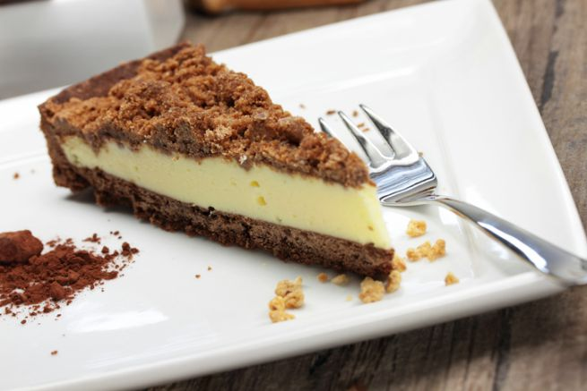

Tra i dolci al caffè, la sbriciolata coppa del nonno occupa decisamente un posto di rilievo. Non potrebbe essere altrimenti: strati di crema al caffè (a base di ricotta o, per i più golosi, mascarpone) intervallati da burrose e fragranti briciole da gustare un morso dopo l'altro.

La sbriciolata coppa del nonno senza cottura, ed anche senza colla di pesce, è super appetitosa e può essere servita al termine di pranzi e cene, informali e non. Bastano pochi e semplici step per realizzare un dolce che, una volta in tavola, farà gola a molti. Non indicata per i più piccoli, si può preparare con il caffè decaffeinato e con quello di orzo, anche se non otterrete lo stesso risultato in termini di gusto. Provate questa torta del nonno al caffè: ha una marcia in più. 

Ingredients
===========

* 400gr di biscotti al cacao
* 180gr di burro
* 300gr di panna
* 300gr di mascarpone o ricotta
* vaniglia
* 75gr di zucchero a velo
* 4 tazzine di caffè ristretto
* cacao amaro qb 

Preparation
===========

Tritate i biscotti grossolanamente e mescolateli con il burro fuso e freddo. Amalgamate e rivestite una tortiera con apertura a cerniera con carta forno, quindi versate sopra 2/3 del composto di biscotti compattando bene e rivestendo anche i bordi. Trasferite in frigo e dedicatevi alla preparazione della farcia. Mescolate il mascarpone (o la ricotta) con lo zucchero e la vaniglia. Unite il caffè e mescolate ancora. Adesso montate la panna a neve ferma ed incorporatela al composto precedente, ma senza farla smontare. Trasferite sulla base di biscotti e livellate, quindi coprite il tutto con i biscotti al cacao misti al burro, sbriciolandoli bene sopra. Trasferite in frigo per 4 ore almeno, o meglio tutta la notte, prima di servire. 

Notes
=====
