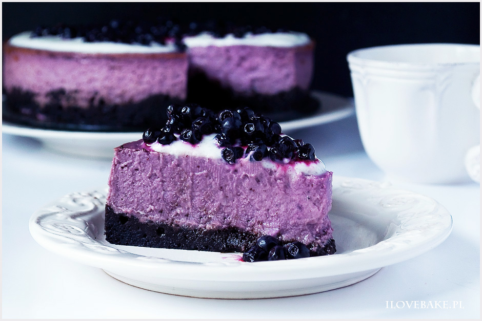

Sernik jagodowy z mrożonymi jagodami idealny poza sezonem. Jeden z pyszniejszych serników na spodzie z ciastek oreo. Słodki, jagodowy i bardzo delikatny z lekkim kremem śmietankowym.

Sernik wykonujemy na twarogu półtłustym trzykrotnie mielonym. Zamiennie możesz użyć dobrej jakości sera z wiaderka np. Piątnicy. Twaróg musi być dobrze zmielony i lekki w konsystencji, aby sernik wyszedł lekki.

Jagody wcześniej rozmrażamy i przeciskamy przez drobne sitko, aby uzyskać gładką konsystencję bez skórek. Przecier z jagód nada pięknego koloru i cudownego jagodowe smaku.

Krem śmietankowy wykonałam tym razem w lżejszej wersji z jogurtem greckim. Składniki muszą być prosto z lodówki. Miksujemy je razem, aż uzyskamy gęstą masę. Dodajemy cukier puder do smaku i wykładamy przed podaniem na sernik. Dekorujemy jagodami (użyłam mrożonych) i dodatkowo jeśli masz ochotę ścieramy białą czekoladę, która fajnie podkręci smak.

Sernik jagodowy pieczony to inna odsłona sernika z jagodami, który wykonywałam latem. Sernik jest lekki, kremowy i delikatny. Słodki z wyczuwalnym smakiem jagód. Pyszny deser poza sezonem i w dodatku o przepięknym kolorze.

Ingredients
===========

SKŁADNIKI NA SPÓD:

* 300gr ciastek oreo
* 80gr masła, roztopionego
* 1 łyżka kakao

SKŁADNIKI NA MASĘ SEROWĄ:

* 1kg twarogu półtłustego, trzykrotnie mielonego*
* 1 szklanka cukru
* 1 łyżeczka ekstraktu z wanilii lub esencji
* 4 jajka
* 1 łyżka soku z cytryny
* 2 łyżki mąki pszennej
* 1 łyżeczka mąki ziemniaczanej
* 300g jagód (wcześniej rozmrożonych)

SKŁADNIKI NA MASĘ ŚMIETANKOWĄ:

* 100gr jogurtu greckiego
* 100ml śmietanki kremówki 30%
* 2-3 łyżki cukru pudru
* jagody do dekoracji

1 szklanka o pojemności 250 ml

twaróg można zastąpić serem z wiaderka dobrej jakości

Preparation
===========

Składniki na masę serową powinny być w temp. pokojowej.
Ciasteczka oreo mielimy w malakserze lub wkładamy do mocnego woreczka foliowego i rozdrabniamy wałkiem. Następnie dodajemy roztopione masło oraz kakao i mieszamy dokładnie. Tortownicę o śr. 24 cm wykładamy papierem do pieczenia lub używamy silikonowej ze szklanym dnem. Folią aluminiową zabezpieczamy dno tortownicy, aby nie przedostała się woda podczas pieczenia w kąpieli wodnej. Masę z ciastek wykładamy na spód, wyrównujemy. Wkładamy na 30 min do lodówki.
Twaróg miksujemy z cukrem, ekstraktem, sokiem z cytryny oraz jajkami. Następnie dodajemy jagody przeciśnięte przez drobne sitko. Na koniec masę łączymy z przesianymi mąkami i wylewamy na schłodzony spód. Formę wkładamy do większego naczynia. Wlewamy gorącą wodę do 1/2 wysokości. Pieczemy w temp. 150 C przez 1-1,5 godziny. Sernik powinien być ścięty i lekko sprężysty w środku. Po upieczeniu zostawiamy w piekarniku na 2-3 godziny. Następnie wyciągamy i zostawiamy do całkowitego wystudzenia. Po tym czasie wkładamy na noc do lodówki.
Jogurt oraz kremówkę miksujemy razem na gęstą masę. Na koniec łączymy z cukrem pudrem. Wykładamy na wierzch sernika i dekorujemy jagodami.

Notes
=====

