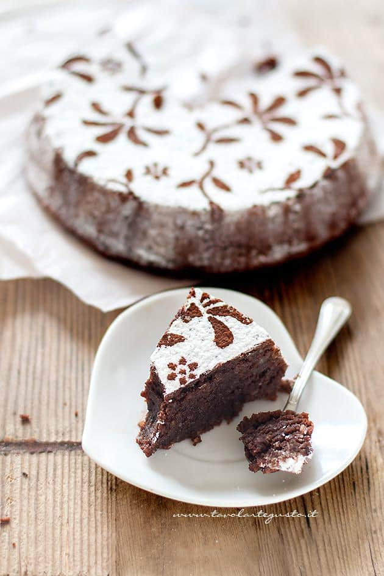

La Torta Caprese è un dolce partenopeo tipico dell’Isola di Capri a base di cioccolato fondente e mandorle, dal cuore morbidissimo e un gusto paradisiaco!

Un dolce squisito come pochi, che ha origini antichissime; la sua creazione risale al 1920 da un errore del pasticciere caprese Carmine di Fiore, che intento a preparare il suo dolce alle mandorle da servire a tre malavitosi giunti a Capri per comprare una partita di ghette di Al Capone; probabilmente per la fretta, si dimenticò di aggiungere la dose di farina nel dolce! A fine cottura però, con sommo stupore, la torta risultò non solo buonissima, ma di una prelibatezza unica: morbida dentro e croccante fuori, tanto che anche i tre americani ne rimasero estasiati, chiedendo al pasticciere la ricetta che da allora prese il nome appunto di Torta Caprese, diventando l’orgoglio indiscusso dell’isola del sogno e ben presto anche della Costiera Amalfitana e della Penisola Sorrentina.

Ingredients
===========

Quantità per un stampo da pastiera diamentro largo 20 cm ( che poi va stringendosi sul fondo) – altezza 4 cm oppure uno stampo da 18 cm classico a cerniera

* 185gr di mandorle pelate o farina di mandorle
* 125gr di cioccolato fondente di ottima qualità
* 125gr di burro
* 3 uova medie
* 125gr di zucchero semolato
* 1 buccia di arancia
* 1tsp di Gran Marnier oppure Rum
* zucchero a velo per decorare

Preparation
===========

Sciogliete a bagnomaria il cioccolato spezzettato insieme al burro. Ponete su fuoco lento e girate costantemente fino ad ottenere un composto liscio e privo di pezzettini. Ponete da parte il composto di cioccolato.

Separate i tuorli dagli albumi.

Montate per qualche minuto i tuorli con 80 gr di zucchero e la buccia d’arancia, fino ad ottenere un composto spumoso e liscio.

Aggiungete il liquore.

Aggiungete al composto di tuorli montati il cioccolato fuso. Aiutatevi con le fruste elettriche per montare il composto e renderlo liscio e vellutato.

Aggiungete la farina di mandorle o le mandorle pelate ridotte in polvere. Questa volta almagamate il composto con una spatola.

Montate gli albumi a neve con il resto dello zucchero.

Amalgamate gli albumi con la spatola dal basso verso l’alto, cercando di non smontare il composto.

Vedrete che l’impasto finale assumerà un aspetto vellutato e gonfio. Imburrate e infarinate perfettamente la teglia. Versate il composto della Torta Caprese e livellate il più possibile la superficie.

### Cottura perfetta della Torta Caprese

La Cottura della Torta Caprese contribuisce a rendere il dolce umido dentro e croccante fuori. Dunque seguite questi trucchi per non sbagliare:

1. utilizzate forno statico (il forno ventilato secca e asciuga particolarmente il cuore delle torte!)
2. preriscaldate il forno a 180° prima di inserire la torta! che risulti quindi ben caldo!
3. Cuocere nella parte media del forno per circa 30 – 35 minuti .

I tempi di cottura possono variare da forno a forno, ma ricordatevi che la Caprese al cioccolato dev’essere umida dentro! quindi di norma per uno stampo da 18 cm il tempo non supera mai i 35 – 38 minuti! pena, una caprese morbida ma non tartufata come deve essere! Quindi dopo 30 minuti, fate la prova stecchino: si sarà già formata la crosticina e il cuore deve risultare umido. Non eccessivamente bagnato ma umido!!

Sfornate e lasciate raffreddare in teglia per almeno 30 – 40 minuti!

Questo passaggio è fondamentale! se capovolgete subito la Torta Caprese, rischiate di spaccarla! Aspettate che si sia intiepidita.

Successivamente con il coltello a punta tonda circondate i contorni della teglia e su un piatto da portate capovolgete la vostra Torta Caprese!

Trasferite su una gratella e lasciate completamente raffreddare!

Decorate la Caprese al cioccolato quando è ben fredda! Se aggiungete lo zucchero a velo quando è ancora calda, lo zucchero verrà assorbito dalla superficie!

Notes
=====
