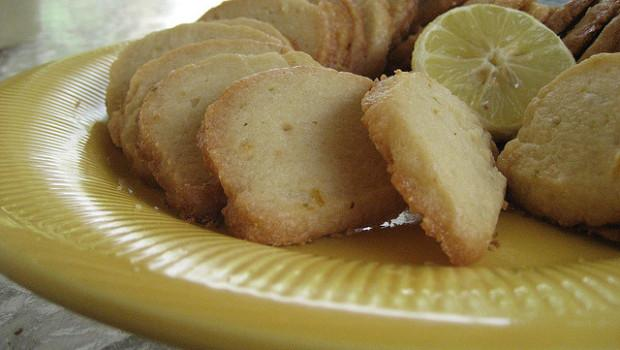

I **biscotti al limone e cannella**, neanche a dirlo, risultano essere perfetti in particolar modo per accompagnare il te. Avete presenti quei freddi pomeriggi passati in casa quando il tempo sembra non scorrere mai? Prepararli e gustarli poi a lavoro concluso, quando la cucina profuma in maniera irresistibile, rappresenta la migliore e più piacevole soluzione.

La ricetta dei **biscotti al limone e cannella** è semplice ed abbastanza veloce, escludendo il tempo necessario al riposo in frigo che devo ammettere di saltare a volte perchè troppo impaziente per attendere ancora di poterli gustare appena tirati fuori dal forno. Vi consiglio vivamente di abbondare sia con la cannella che con la scorza di limone responsabili, non solo del profumo paradisiaco, ma anche dell'aroma di questi irresistibili biscotti. Provate anche i[ biscotti con marmellata di limoni](http://www.gustoblog.it/post/137630/ecco-i-biscotti-con-marmellata-di-limoni-perfetti-per-il-te) e i[ biscotti al limone semplici](http://www.gustoblog.it/post/122881/la-ricetta-dei-biscotti-al-limone-da-accompagnare-con-il-te).

Ingredients
===========

* 300gr di farina 00
* 2 uova
* 125gr di zucchero di canna
* 50gr di olio di semi
* scorza grattugiata di due limoni
* succo di 1/2 limone
* 1 cucchiaino colmo di cannella
* 1 pizzico di sale

Preparation
===========

Versare in una ciotola la farina 00 setacciata e porre al centro il resto degli ingredienti. Iniziare ad impastare con le mani all'interno della stessa quindi trasferire su una spianatoia e lavorare bene. Ottenuto un composto omogeneo e sodo porlo in frigo a riposare per 30 minuti, avvolto nella pellicola trasparente, quindi riprenderlo e stenderlo. Ritagliarlo con le apposite formine ottenendo i biscotti della forma desiderata e disporli sulla placca del forno rivestita di carta forno. Farli cuocere a 180 °C per circa 12 minuti.

Notes
=====
