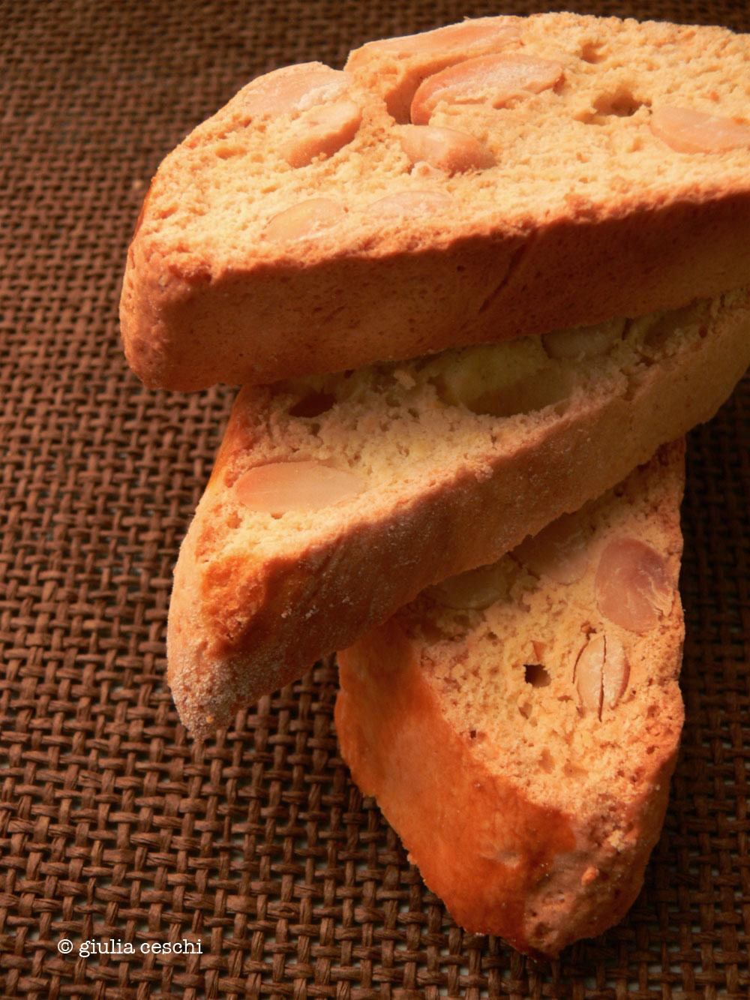

Quella che vi andiamo a presentare oggi è la preparazione dei **Cantucci con la ricetta tradizionale**, biscotti tipici della tradizione dolciaria italiana, perfetti da gustare al termine di un pasto, ma anche da proporre come regalo goloso di Natale.

Ingredients
===========

* 300g farina 00
* 160g zucchero
* una noce di burro
* 2 uova
* 130g mandorle con la buccia
* 1/2tsp lievito
* un pizzico di sale
* 1 tuorlo

Preparation
===========

Iniziamo la nostra ricetta partendo dalle **mandorle**: disponetele sopra una placca precedentemente ricoperta con un foglio di carta oleosa e fatele tostare per qualche minuto nel forno preriscaldato a 200 grado, quindi mettetele da parte a freddare.

Nel frattempo, procedete con l’impasto: iniziate a lavorare all'interno di una ciotola le **uova**, lo **zucchero** e una presa di **sale**. Una volta ottenuto un composto abbastanza spumoso, incorporatevi il **burro** ammorbidito e, successivamente la **farina** e il **lievito**. Mescolate bene finché non avrete un impasto morbido. Aggiungete infine anche le mandorle.

A questo punto dividete l’impasto a metà; questi due panetti, poi, li andrete a trasformare in filoncini spessi 3/4 centimetri di diametro che andrete a cuocere nel forno a 200°per 20 minuti, dopo aver spennellato la loro superficie con un tuorlo sbattuto.

Trascorso il tempo indicato, togliete l’impasto dal forno e attendete un paio di minuti, in modo che si freddi. Tagliate infine i filoncini in fettine spesse circa 1 centimetro e metteteli nel forno a tostare per altri 15 minuti a 200°. Da gustare tiepidi o freddi.

Notes
=====

