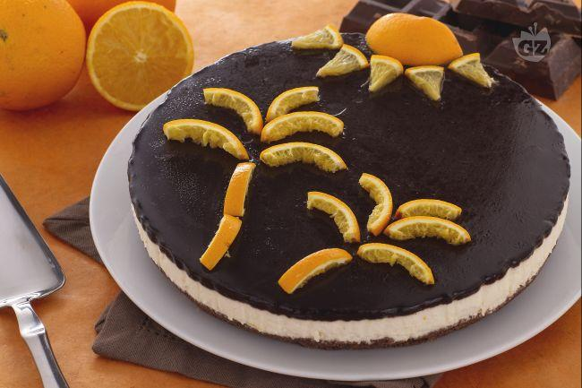
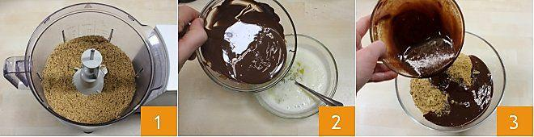
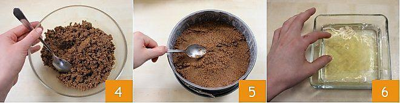
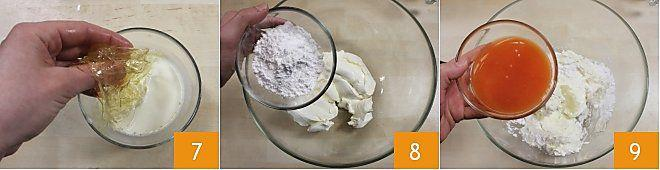
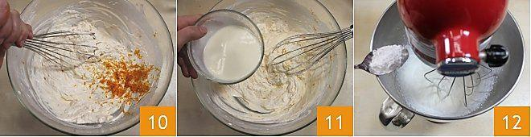
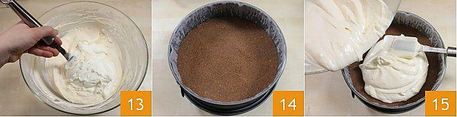
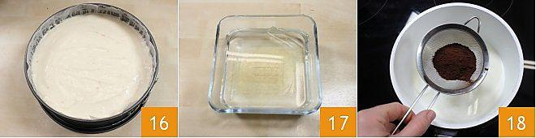
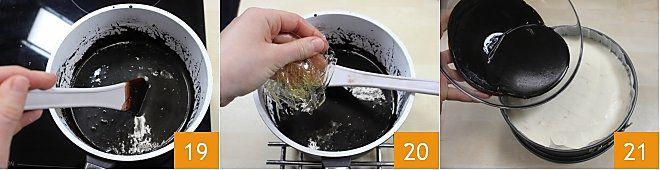
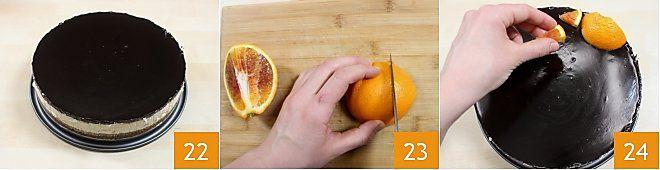
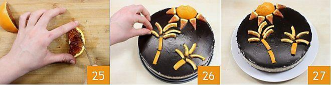

* Difficoltà: **molto bassa** 							
* Preparazione: **35 min** 					
* Dosi per: **10 persone** 							
* Costo: **basso** 							
* Nota: Più 8 ore e mezza per il rassodamento della torta in frigorifero

La cheesecake arancia e cioccolato è una deliziosa torta fredda in cui il profumo dell'arancia si  sposa bene con il sapore del cioccolato fondente.

Valentina Boccia di "[Ho voglia di dolce](http://blog.giallozafferano.it/hovogliadidolce/)", una delle tre vincitrici del concorso Cheesecakemania indetto da Philadelphia, si è ispirata alla Sicilia, al suo sole e ai suoi agrumi per crearla e il risultato è una torta fresca e golosa.

Il fondo di biscotti è arricchito con il cioccolato fondente mentre la crema del ripieno è aromatizzata con scorza e succo d'arancia; per finire una glassa al cioccolato ricopre la cheesecake, creando un contrasto irresistibile tra l'arancia e il cioccolato.

La cheesecake arancia e cioccolato si presta per essere decorata in moltissimi modi diversi: noi abbiamo disegnato delle palme sotto un sole splendete e voi... scatenate la fantasia!

Ingredients
===========

## Ingredienti per la base

* 200g Biscotti Digestive
* 80g Cioccolato fondente
* 100g Burro

## Ingredienti per il ripieno

* 500g Philadelphia classico
* 200g Panna liquida fresca
* 160g Arance (succo di)
* 1 scorza grattugiata di arancia 
* 120g Zucchero a velo
* 15g Colla di pesce

## Ingredienti per la glassa al cioccolato

* 70ml Panna liquida fresca
* 70ml Acqua
* 80g Zucchero semolato
* 40gr Cacao in polvere amaro
* 5g Colla di pesce

Preparation
===========

Per realizzare la cheesecake arancia e cioccolato, iniziate a preparare la base: frullate i biscotti digestive finemente in un mixer; sciogliete il cioccolato fondente e il burro separatamente, a bagnomaria o in microonde, quindi potete unirli direttamente nei biscotti oppure amalgamare prima il cioccolato e il burro insieme e poi aggiungete il tutto ai biscotti tritati.									

Amalgamate bene gli ingredienti con un cucchiaio e versate quindi il composto in una tortiera da 22 cm di diametro, meglio se a cerchio apribile, foderata con da carta da forno (guarda la[ Scuola di cucina: foderare una tortiera](http://ricette.giallozafferano.it/Foderare-una-tortiera-con-carta-da-forno.html)). Compattate bene il fondo con il dorso di un cucchiaio e mettete la base ottenuta a riposare in frigorifero per 30 minuti o in freezer per 10. Passate ora alla preparazione della crema per il ripieno: ammollate la colla di pesce in abbondante acqua fredda per 10 minuti e										

quando si sarà ammorbidita, scioglietela in due cucchiai di panna, prelevati dalla dose totale, ben calda. Versate in una ciotola capiente il philadelphia con 60 gr di zucchero a velo e 160 ml di succo di arancia filtrato.										

Amalgamate bene con una frusta il tutto, fino a quando otterete una crema ben morbida, e aggiungete la scorza grattugiata di un'arancia. Unite anche la panna in cui prima avete sciolto la colla di pesce  e mescolate ancora. Montate ora la panna insieme ai 60 gr di zucchero a velo rimasti guarda la[ Scuola di cucina: come montare la panna](http://ricette.giallozafferano.it/Come-montare-la-panna.html)).	

Unite la panna montata alla crema di Philadelphia e arancia, mescolando delicatamente con una spatola dal basso verso l'alto per non smontare la panna. Estraete dal frigo la base di biscotto, ormai compatta, e versateci soprala crema del ripieno.					

Stendete uniformementela la crema e livellate la superficie della cheesecake con il dorso di un cucchiaio. La cheesecake dovrà riposare e rassodare in frigorifero per almeno 6 ore, o meglio per tutta una notte. Trascorso questo tempo, occupatevi della glassa al cioccolato: mettete la colla di pesce in ammollo in acqua fredda per circa 10 minuti, e, nel frattempo, in un pentolino scaldate l’acqua e la panna quindi aggiungete lo zucchero semolato e il cacao amaro setacciato.

Fate sciogliere e amalgamare bene gli ingredienti, tendendo il fuoco basso per circa 10 minuti e mescolando spesso. Togliete il pentolino dal fuoco e unite la colla di pesce morbida ben strizzata e amalgamatela bene alla glassa. Fatela intiepidire e poi versate la glassa sulla superficie della torta ormai ben compatta. Riponete la cheesecake in frigorifero per altre due ore, in modo che la glassa si rapprenda.		

Trascorso il tempo necessario, togliete la cheesecake dallo stampo e passate alla decorazione. Noi abbiamo disegnato delle palme sotto ad un sole splendente: tagliate in quarti un’arancia, prendete un quarto e tagliate un'estremità per ottenere una mezza luna; ricavate degli spicchi dalla parte restante. Posizionate la mezzaluna su un lato superiore della torta, in questo modo rappresenterete un sole, e poggiate gli spicchi intorno ad essa così da avere i raggi.

Tagliate poi a fette gli altri quarti d'arancia e ricavate da esse le scorze. Tagliatele in piccole parti e sistematele in modo da creare due palme. Ora che la vostra cheesecake arancia e cioccolato è decorata, è pronta per essere servita!				

Notes
=====

## Note

Le quantità vanno bene per una torta di diametro maggiore, almeno 24cm ma forse 26cm è perfetto. Non compattare troppo i biscotti tritati all’inizio perchè li rende troppo duri. La glassa al cioccolato sa poco di cioccolato, forse è meglio prepararla con pezzi di cioccolato invece che con cacao (o diminuire la panna). Rispettare assolutamente le quantità di colla di pesce, pena una glassa/crema che si scioglie troppo facilmente.

#### Conservazione						

Conservate la cheesecake arancia e cioccolato, ben coperta, in frigorifero per 3-4 giorni.

Potete anche congelare la vostra cheesecake arancia e cioccolato, intera o porzionata, e poi scongelarla in frigorifero al bisogno.									

#### Consiglio

Potete decorare la cheesecake secondo la vostra fantasia, incorniciandola con delle fette d'arancia anche sui lati per esempio!

