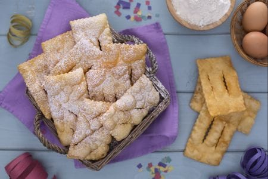

Le chiacchiere sono croccanti e delicate sfoglie fritte tipiche del periodo di Carnevale e sono chiamate con nomi diversi a seconda delle regioni di provenienza: chiacchiere e lattughe in Lombardia, cenci e donzelle in Toscana, frappe e sfrappole in Emilia, cròstoli in Trentino, galani e gale in Veneto, bugie in Piemonte, così come rosoni, lasagne, pampuglie, ecc.. Sono un dolce molto friabile, ottenuto tirando sottilmente un semplice impasto successivamente fritto e cosparso di zucchero a velo per il tocco finale. La loro forma rettangolare, con due tagli netti centrali, rende le chiacchiere inconfondibili e attira immediatamente da tempo immemore la golosità di grandi e piccini.

Ingredients
===========

* 500gr farina
* 50gr burro a temperatura ambiente
* 3 uova
* 1 baccello di vaniglia
* 1 pizzico sale fino
* 70gr zucchero
* 30gr grappa
* 6gr lievito in polvere
* 1 tuorlo
* olio per friggere
* zucchero a velo

Preparation
===========

Per preparare le chiacchiere, setacciate la farina assieme al lievito e versate in una planetaria con foglia. Aggiungete lo zucchero, il sale, le uova sbattute in precedenza e la grappa. Lavorate fino ad amalgamare bene gli ingredienti.

Sostituite la foglia con il gancio, unite i semi della bacca di vaniglia e il burro, quindi continuate ad impastare per 15 minuti fino ad ottenere un composto omogeneo: dovrà risultare sostenuto ma abbastanza malleabile. Se necessario potete aggiungere 5/10 gr di acqua. Trasferite l’impasto su un piano da lavoro, e maneggiatelo rapidamente per dargli una forma sferica.

Avvolgete il panetto con la pellicola trasparente e lasciatelo riposare a temperatura ambiente per almeno 30 minuti. Trascorso questo tempo, dividete la pasta in porzioni da 150 g circa e iniziate a lavorare ognuna singolarmente. Appiattite leggermente una prima porzione con il palmo della mano, infarinatela e stendetela con il tirapasta impostato sullo spessore più largo.

Ripiegate verso il centro i lati corti della striscia di pasta ottenuta, dopodiché tiratela nuovamente impostando ogni volta il tirapasta su uno spessore sempre minore, fino a raggiungere i 2 mm. Eseguite lo stesso procedimento su tutte le porzioni di impasto. Lasciate riposare qualche minuto la sfoglia tirata e nel frattempo portate l’olio alla temperatura di 150-160°. Con una rotella a taglio smerlato procedete sagomando dei rettangoli di circa 5x10 cm e praticando su ognuno due tagli centrali, paralleli al lato lungo.

Non appena l’olio ha raggiunto la giusta temperatura immergetevi 2-3 rettangoli di sfoglia con l’aiuto di una schiumarola e fateli cuocere rigirandoli su ambo i lati fino a che non raggiungono la doratura. Scolate le sfoglie su carta assorbente e, una volta fredde, impiattatele e cospargetele con abbondante zucchero a velo setacciato.
Le vostre chiacchiere sono pronte.

Notes
=====
