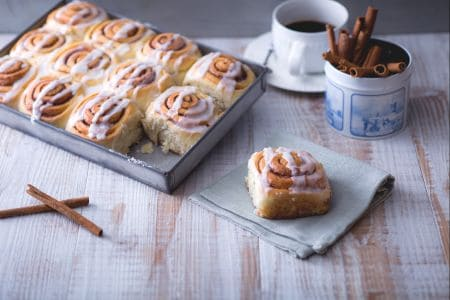

Arrotolati, soffici e profumati, in Svezia sono conosciuti come Kanelbulle, e vengono serviti durante la fika, la tradizionale pausa al caffè con dolcetto. Ma è negli Stati Uniti che poi sono diventati famosissimi e hanno spopolato in tutto il mondo con il nome di cinnamon rolls. Una pasta brioche preparata con un metodo molto diffuso in America, dove le polveri vengono mischiate insieme e da parte si mescolano i liquidi e infine vengono unite insieme per ottenere l’impasto soffice. Ma ciò che rende davvero irresistibili i cinnamon rolls è la presenza di un delizioso mix di zucchero e cannella e la glassa di copertura colata poco prima di servirli.

Il momento migliore per servire queste girelle? Ovviamente a colazione o durante il famoso brunch all’americana. Ma a noi sono piaciuti talmente che ve li proponiamo praticamente per qualunque occasione: i cinnamon rolls sanno davvero conquistare tutti!

Ingredients
===========

* 60gr Zucchero
* 615gr Farina 00
* 5gr Lievito di birra secco
* 5gr Sale
* 120ml Acqua a temperatura ambiente
* 120ml Latte intero a temperatura ambiente
* 80gr Burro
* 1 Uova

Per aromatizzare e spennellare

* 110gr Zucchero
* 15gr Cannella in polvere
* 40gr Burro (per ungere la teglia e per spennellare l'impasto)

Per glassare

* 200gr Zucchero a velo
* Acqua a temperatura ambiente q.b. 

Preparation
===========

Per preparare i cinnamon rolls cominciate facendo sciogliere il burro a fuoco dolce e lasciandolo poi intiepidire una volta pronto. Versate quindi in una ciotola tutti gli ingredienti secchi, quindi la farina e lo zucchero, il lievito secco (oppure fresco sbriciolato direttamente in ciotola, 18 g) e il sale e mescolate.

Fate lo stesso con gli ingredienti liquidi. In una ciotola versate l’acqua insieme al latte e l’uovo leggermente battuto.

Continuate poi con il burro fuso che avrete lasciato intiepidire e mescolate il tutto con un cucchiaio di legno. A questo punto unite gli ingredienti liquidi a quelli secchi.

e, aiutandovi con il cucchiaio, mescolate fino ad ottenere un composto amalgamato. Trasferitelo sul piano da lavoro e impastate a mano fino ad ottenere una sfera liscia ed omogenea. Potete unire un pizzico di farina se necessario per lavorare più facilmente. L'impasto è pronto quando impastando le vostre mani risulteranno pulite.

Ungete con del burro una bacinella e riponete l’impasto al suo interno, coprite con pellicola trasparente e lasciate lievitare per almeno 30 minuti ad una temperatura tra i 20° e i 25° (in alternativa potrete tenere la ciotola in forno spento ma con la luce accesa).

Passate alla preparazione del mix per aromatizzare. In una ciotola versate lo zucchero e la cannella in polvere, mescolate per bene e tenetelo da parte.

Riprendete l’impasto lievitato e sgonfiatelo su una spianatoia leggermente infarinata con l’aiuto di un matterello. Ottenete un rettangolo di 50x35 cm.

poi spennellate con il burro fuso e cospargete con ¾ del mix aromatizzante avendo cura di distribuirlo su tutta la superficie.

Arrivati a questo punto dovrete procedere ad arrotolare l’impasto. Cominciate sollevando delicatamente il lembo inferiore lungo tutto il lato più lungo, in questo modo vi aiuterete a staccarlo dalla spianatoia. Dopodiché procedete ad arrotolare un po’ alla volta e facendo attenzione ad arrotolare strettamente e senza schiacciare l’impasto. Ottenuto il rotolo dovrete modellarlo con le mani in modo da ottenere una lunghezza di 48cm, perciò tenete ferma un'estremità con la mano e con l'altra fate delle leggere pressioni verso l'estremità che state bloccando, per dare una forma omogenea.

Con una lama affilata dividete a metà il rotolo, dividete una delle metà ancora a metà e da ciascuna suddivisione dovrete ottenere 3 dischi delle stesse dimensioni (circa 3-4 cm). Proseguite allo stesso modo anche per l'altro pezzo. Otterrete con queste dosi 12 rotelle; potete modellarle leggermente con le mani per arrotondare la forma.

Ungete una teglia rettangola da 30x20cm e cospargetela con il ¼ restante del mix profumato. Sistemate i rotolini nella teglia tutti nello stesso verso distanziandoli tra loro 1 cm circa. Una volta disposti tutti i pezzi schiacciate delicatamente con le dita per rendere omogenea la forma di ogni rotolino.

e infine coprite con pellicola trasparente lasciando lievitare per altri 30 minuti almeno. Trascorso il tempo le girelle saranno raddoppiate, quindi passate alla cottura. I cinnamon rolls cuociono in forno preriscaldato, in modalità statica, a 180° per circa 30 minuti. Una volta cotti lasciateli raffreddare completamente.

Per preparare la glassa versate lo zucchero a velo in un recipiente e unite un po’ d’acqua fredda poco alla volta e iniziate a mescolare, continuate ad aggiungerne se necessaria, sempre un cucchiaio alla volta, fino ad ottenere una consistenza vischiosa e per finire cospargete i vostri cinnamon rolls con la glassa prima di gustarli.

Notes
=====

Potete preparare in anticipo l’impasto dei cinnamon rolls: sarà sufficiente ridurre la quantità di lievito e conservare l’impasto in frigorifero per 8-12 ore; il giorno dopo sarà sufficiente riprendere l’impasto e lasciarlo acclimatare prima di continuare come da ricetta.

Una volta cotti, i cinnamon rolls si conservano a temperatura ambiente (o in frigorifero), per 1-2 giorni al massimo: ma in questo caso sarebbe opportuno non glassarli in anticipo, poiché questo diventerà uno sciroppo lucido che ammorbidirà molto l’impasto.
