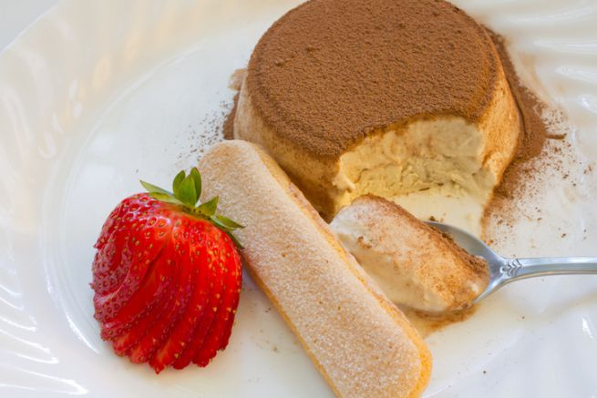

Tra le ricette dei semifreddi, quella della delizia al caffè di Alessandro Borghese è particolarmente semplice e adatta a concludere al meglio pranzi e cene in compagnia. Un dolce al caffè scioglievole al palato e veramente facile nella realizzazione da non potersi far scappare, insomma. Adatto a tutte le occasioni, dalle più comuni a quelle formali, potete preparare la delizia al caffè anche in anticipo e tenerla in freezer fino al momento nel quale vi servirà.

Per ottenere delle delizie al caffè e mascarpone, sostituite semplicemente quest'ultimo alla panna, il risultato sarà altrettanto godurioso. 

Ingredients
===========

* 100ml di caffè freddo
* 5gr di cacao in polvere amaro
* 250ml di panna vegetale montata
* 80gr di cioccolato fondente fuso
* 3 tuorli montati con lo zucchero
* 3 albumi montati a neve
* 8 cucchiai di fiocchi di mais al cioccolato

Preparation
===========

Montate gli albumi a neve ferma con le fruste elettriche. Fate sciogliere il cacao amaro in polvere nel caffè. Unite, quindi, gli albumi, ma senza farli smontare. Unite anche la panna vegetale montata, i tuorli, anch'essi montati in precedenza con lo zucchero, e mescolate fino ad ottenere un composto omogeneo.

Distribuite sul piano di lavoro degli stampini di alluminio usa e getta. Ponete sul fondo di ognuno di essi un cucchiaio di fiocchi di mais al cioccolato, quindi copriteli con la crema al caffè. Trasferite gli stampini in freezer per almeno 5 ore prima di consumarli, meglio se tutta la notte. Prelevate i semifreddi dagli stampini e decorateli con del cioccolato fuso prima di servirli. 

Notes
=====
