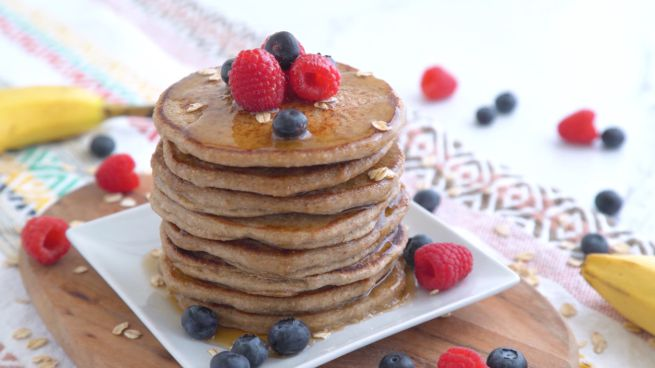

Iniziare la giornata con il piede giusto è il nodo migliore per affrontare con il sorriso gli impegni della giornata. E quale modo migliore per farlo se non con i pancake con banana e nutella, dolcetti buonissimi e molto semplici che potete preparare per i bambini ma anche per la vostra dolce metà! I pancake sono frittelle che fanno parte della tradizione della cucina anglosassone, si possono preparare in tante versioni diverse, da quella base con il latticello fino alle varianti con mele, gocce di cioccolato, mirtilli ecc. 

Ingredients
===========

* 2 uova
* 200gr di farina
* 240ml di latte
* 2 cucchiai di nutella
* 1 banana matura
* 35gr di zucchero
* 2 cucchiaini di lievito per dolci
* Olio di semi
* Zucchero a velo (facoltativo) 

Preparation
===========

Sbattete le uova con lo zucchero fino ad avere un composto abbastanza gonfio. Nel frattempo schiacciate la banana con la forchetta, unitela al composto di uova e mescolate bene.

Aggiungete la farina setacciata con il lievito, il latte e la nutella e mescolate tutto fino ad avere un composto omogeneo.

Scaldate una padella antiaderente e mettete un filo di olio di semi, versate un mestolino di pastella e cuocete la frittella a fuoco medio, quando compariranno le bolle girate il pancake con una spatola e completate la cottura dall’altro lato. Procedete così per tutta la pastella e, man mano, impilate i pancake uno sopra l’altro.

Guarnite con nutella, fettine di banana e zucchero a velo.

Notes
=====

