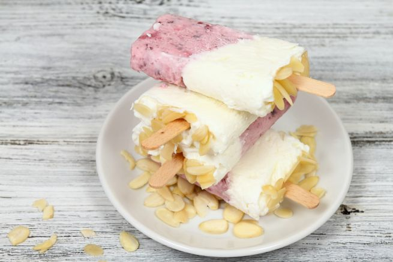

Avete voglia di un dolcetto fresco ma senza sensi di colpa? Provate i nostri stecchi di gelato allo yogurt, dolci leggeri e buonissimi che sarà bello preparare e poi, ovviamente, anche mangiare! La nostra è una ricetta base che potete personalizzare usando la frutta che più vi piace e lo yogurt del tipo e del gusto che volete, va bene anche lo yogurt di soia.

Ingredients
===========

* 250gr di yogurt al limone o bianco
* 250gr di frutta
* 60gr di zucchero
* Succo di mezzo limone
* Scaglie di mandorle
* 140ml di latte

Preparation
===========

Prendete una ciotola e mettete dentro lo zucchero, il latte, lo yogurt e il succo di limone, mescolate bene tutto in modo da avere un composto omogeneo. A parte pulite la frutta e frullatela con il mixer.

Dividete la crema di yogurt in due parti, in una aggiungete la frutta frullata e mescolate bene. Prendete gli stampi per ghiaccioli e riempiteli per metà con il composto alla frutta, ponete in freezer mezz’oretta e poi mettete il composto di solo yogurt. Fate riposare in freezer mezz’ora e poi aggiungete i bastoncini e le mandorle. Fate rassodare 5 – 6 ore in freezer e servite.

Notes
=====
