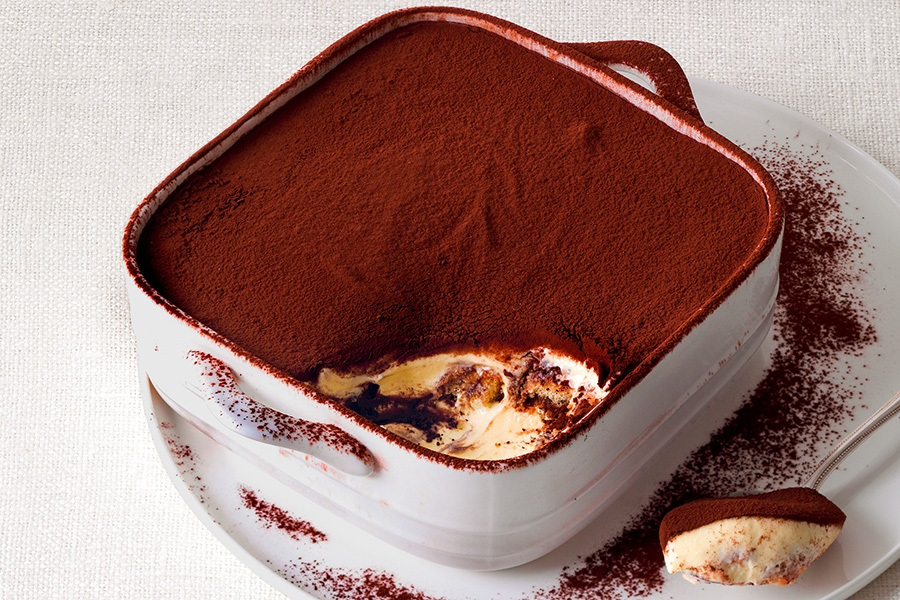

This is based off the source's recipe but I've customized to my needs and through making it dozens of time.

Ingredients
===========

* 500gr mascarpone
* 300gr biscotti savoiardi
* 3 Moka coffee (about 250ml)
* 120gr zucchero
* 2tsp Marsala (o altro liquore)
* 4 uova
* cacao amaro
* sale

Preparation
===========

Per la ricetta classica del tiramisù, sciacquate con cura i gusci delle uova, separate gli albumi dai tuorli in due ciotole diverse e unite a questi ultimi lo zucchero e un pizzico di sale.

Tenete da parte gli albumi e sbattete i tuorli con la frusta, finché non diventeranno spumosi e chiari.

Incorporate il mascarpone nei tuorli sbattuti, mescolando con un cucchiaio.

Aggiungetevi il Marsala o altro liquore a scelta.

Montate gli albumi con la frusta a mano o con quelle elettriche: se usate quella manuale sceglietela di grosse dimensioni in modo da incorporare più aria. Unite gli albumi montati al composto di tuorli e mascarpone mescolando la crema dal basso verso l’alto.

Versate il caffè a temperatura ambiente in un piatto basso e largo, mescolatevi un cucchiaio di zucchero.

Immergete 2 savoiardi alla volta nella bagna, per 1 secondo per lato, poi distribuiteli affiancati, in un primo strato, in una pirofila (30x30 cm), senza lasciare spazi vuoti.

Coprite i savoiardi con 1/3 della crema e ripetete le stesse operazioni così da fare altri due strati uguali.

Fate raffreddare il tiramisù in frigo per un paio di ore coperto con un foglio di alluminio, quindi spolverizzatelo con il cacao appena prima di servire.

Notes
=====

Il Marsala può essere aggiunto al caffé come bagna invece, o sia al caffé che agli albumi. Se il tiramisù deve durare qualche giorno in frigo, avere un po' di alchool nella crema evita che diventi acida prima del tempo.
