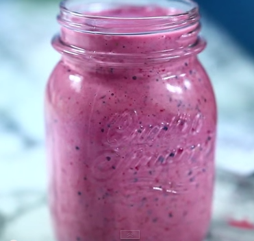

Fonte proteica:latte di mandorla

La frutta aggiunta fornisce il necessario apporto di vitamina C al nostro organismo

Ingredients
===========

* 1 banana
* 1 tazza di frutti di bosco misti (anche surgelati)
* 3 cubetti di ghiaccio
* 1 tazza di latte di mandorla
* 1/4 di tazza di di fragole
* 1 pizzico di zenzero (opzionale)

Preparation
===========

Aggiungi tutti gli ingredienti  in un frullatore e miscela fino alla consistenza cremosa desiderata

Notes
=====

1 porzione contiene 320 calorie di cui: 9 gr di grassi, 1.8 gr di grassi saturi, 6.5 gr di fibre, 37 gr di zuccheri, 9 gr di proteine
