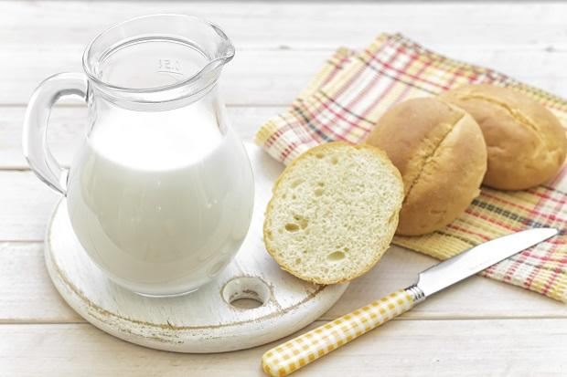

Il latte vaccino è quello più famoso, quello con cui siamo cresciuti e che per noi è la normalità ma ci sono anche delle alternative vegetali, adatte a chi segue un’alimentazione vegana ma anche a chi, semplicemente, vuole provare qualcosa di diverso. Il **latte di riso** è una valida alternativa al latte di mucca, lo potete acquistare al supermercato ma anche fare in casa, è **semplice** e anche abbastanza veloce.

Ingredients
===========

* 1 tazza di riso
* 10 tazze di acqua

Preparation
===========

Prendete una pentola grande e mettete l’**acqua**, portatela a ebollizione e poi versate il **riso**, cuocete per 2 ore a fuoco dolce mescolando ogni tanto. Il tempo di cottura è essenziale perché il riso si deve quasi disintegrare.

Mettete un **canovaccio** pulito e sterilizzato su un’altra pentola e filtrate il liquido, strizzate bene tutto fino a quando non esce più liquido. Rimettete la pentola sul fuoco e cuocete ancora un’oretta mescolando spesso. Travasate[ il latte di riso](http://www.gustoblog.it/post/143742/il-budino-con-latte-di-riso-con-la-ricetta-per-il-bimby) in delle bottiglie di vetro e fatelo raffreddare in frigorifero.

Se volete potete filtrare di nuovo il latte con un altro telo oppure con il velo che si utilizza per i confetti. Magari per molti non è un problema ma trovare piccoli residui di riso può essere fastidioso, quindi è meglio filtrarlo benissimo. Questo latte va servito freddo di **frigo** e si conserva per un massimo di tre giorni.

Se volete potete aromatizzare il latte di riso con una bacca di **vaniglia** oppure con un cucchiaino di **cannella**.

Notes
=====
