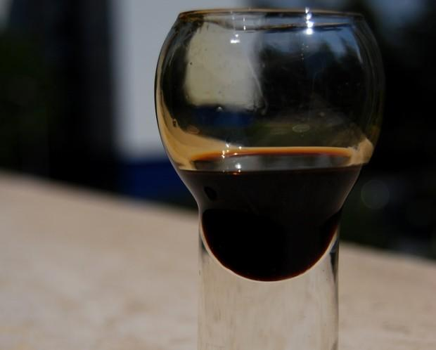

Il **liquore al caffè** è un'ottima ricetta che possiamo preparare anche a casa, con estrema semplicità: gli ingredienti sono davvero essenziali e in tre giorni avremo un[ liquore perfetto da servire ai nostri commensali](http://www.gustoblog.it/post/152782/la-ricetta-del-liquore-allalloro-fatto-in-casa), buono e gustoso, con quel retrogusto di caffè che è assolutamente l'ideale per poter finire degnamente un pasto.

La **ricetta del liquore al caffè** non è difficile: basta seguirla passo dopo passo per poter avere tra le mani un liquore perfetto non solo per essere servito ai propri ospiti, ma anche un'idea regalo originale e sfiziosa da fare in ogni occasione.

Ingredients
===========

* 50gr di caffè macinato
* 350gr di zucchero
* 300ml di alcol per liquori
* 300ml di acqua

Preparation
===========

Mescolate lo zucchero con l'acqua in un pentolino.

Fate bollire acqua e zucchero e una volta raggiunto il momento del bollore aspettate 5 minuti prima di spegnere il fuoco.

Preparate il caffè.

Versate il caffè nello sciroppo continuando a mescolare.

Lasciate raffreddare il liquido e poi aggiungete l'alcol.

Versate il liquore in una bottiglia sterilizzata a chiusura ermetica e fate riposare per 3 giorni prima di servirlo.

Notes
=====
