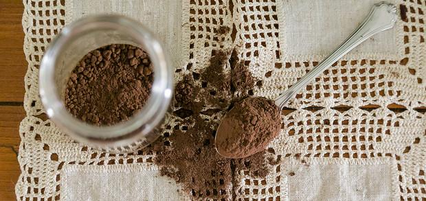

Tra i miei **liquori** preferiti c'è quello al cioccolato. Quello che vi propongo oggi, in particolare, non prevede tra gli ingredienti il latte. Non risulta dunque cremoso tanto quanto quello che lo contiene, ma grazie a tale caratteristica è possibile assaporare appieno il gusto unico del cioccolato. Il liquore va servito al termine dei pasti, come digestivo dopo il caffè: allo stesso tempo appaga la voglia di dolce. Può rivelarsi utile tenerne una piccola scorta in dispensa in modo da offrirlo in caso di visite inaspettate, quelle che solitamente ci colgono impreparati.

Questo tipo di liquore al cioccolato va conservato in dispensa, o al massimo in frigorifero, una volta aperto. Non mi stancherò mai di dirlo ma abbondate con preparazioni del genere: vi torneranno senz'altro utili per i vostri doni natalizi. Provate anche[ il liquore alla cannella](http://www.gustoblog.it/post/135910/come-preparare-il-liquore-alla-cannella-con-la-ricetta-per-il-bimby) e[ quello alla liquirizia](http://www.gustoblog.it/post/136428/come-preparare-il-liquore-alla-liquirizia-con-il-bimby). Ecco come preparare il **liquore al cioccolato senza latte** con la **ricetta facile**

Ingredients
===========

* 200gr di cacao amaro in polvere
* 600gr di zucchero
* 800gr di acqua
* 1 bacca d vaniglia
* 150gr di alcol puro 90°

Preparation
===========

Miscelare cacao amaro in polvere e zucchero quindi versarli in una pentola dai bordi alti. Unire poco alla volta l'acqua continuando a mescolare per evitare la formazione di grumi. Una volta giunta l'ebollizione unire la bacca di vaniglia e cuocere una decina di minuti. Spegnere la fiamma e fare raffreddare completamente, quindi aggiungere anche l'alcool e mescolare bene. Filtrare il composto per eliminare la vaniglia quindi travasare all'interno delle bottiglie pulite ed avvitare bene i tappi.

Notes
=====
