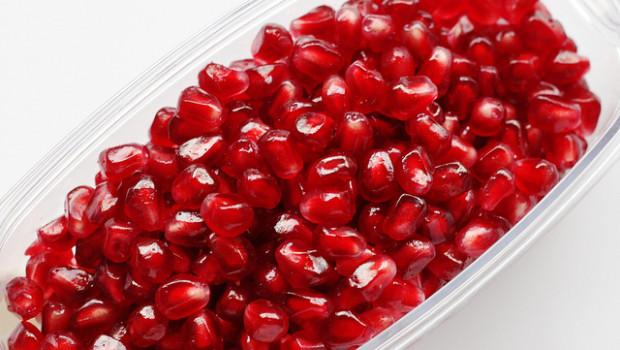

Tra tutti i frutti esistenti la melagrana è senza dubbio uno dei più particolari. Si tratta di un prodotto autunnale tipico dell'Afghanistan e della Persia e si caratterizza per il fatto di avere una polpa composta da tanti piccoli chicchi che ad ogni morso sprigionano il loro succo. La melagrana a differenza di quanto si possa pensare viene utilizzata diffusamente in cucina nella realizzazione di diverse pietanze, dall'antipasto al dolce, liquori compresi.

Ed è proprio la ricetta del **liquore al melograno** che vi propongo oggi. Preparazione semplice da realizzare e con pochi ingredienti tra i quali l'immancabile alcool e dello zucchero. La ricetta originale, che proviene da[ quì](http://seminterra.com/2012/11/15/liquore-al-melograno/), prevede quello di canna integrale, ma nel caso in cui preferiate quello semolato classico utilizzate pure quello. La realizzazione richiede una fase iniziale durante la quale i chicchi dovranno macerare nell'alcool per due settimane. Provate anche il[ liquore all'anice](http://www.gustoblog.it/post/6128/ricette-liquori-il-liquore-allanice) e[ quello al basilico.](http://www.gustoblog.it/post/5160/ricette-liquori-digestivo-al-basilico)

Ingredients
===========

* 1l di alcool alimentare
* 800gr di chicci di melograno
* 800ml di acqua
* 500gr di zucchero di canna

Preparation
===========

Ricavare i chicchi dai frutti, quindi raccoglierli in una ciotola di vetro e metterli a macerare nell'alcool per 15 giorni. Trascorso questo tempo si sarà ottenuto un liquido di colore rosa scuro. Adesso versare l'acqua in una pentola ed accendere la fiamma, raggiunto il bollore unire lo zucchero di canna e cuocere per circa 20 minuti su fiamma bassa. Fare raffreddare quindi unire i chicchi macerati insieme all'alcool e mescolare bene. Travasare nelle bottiglie e chiudere bene. Conservare in dispensa per almeno due settimane prima del consumo.

Notes
=====
