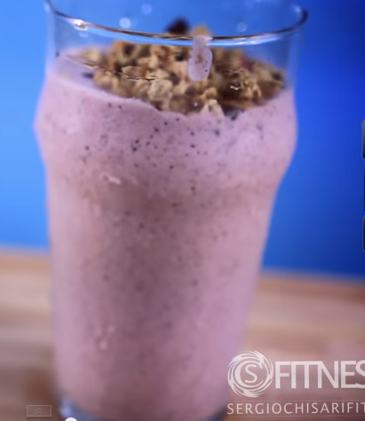

Fonte proteica: proteine in polvere e yogurt greco (opzionale)

Ottimo dessert pur non essendo calorico come i dessert tradizionali.

Ingredients
===========

* 10 fragole
* 2-3 cubetti di ghiaccio
* 1 tazza di latte magro o latte di mandorla o di soia
* 1 misurino di proteine in polvere al gusto cacao
* 2 cucchiai di polvere di cacao fondente
* nocciole (opzionali)

Preparation
===========

Miscela tutto in un frullatore fino ad ottenere la solita consistenza cremosa. Guarnisci a piacere con dello yogurt greco e qualche scaglia di cioccolato fondente

Notes
=====

1 porzione contiene 153 calorie di cui: 3.2 gr di grassi, 0.9 gr di grassi saturi, 20 gr di carboidrati, 3 gr di fibre, 9 gr di zuccheri, 13 gr di proteine
