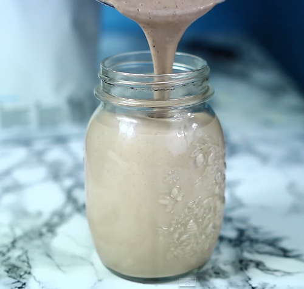

La fonte proteica è data dal latte di soia, dal burro di arachidi e dalle proteine in polvere.

Ingredients
===========

* 1 tazza di latte di soia (sentiti libero di sostituirlo con del latte scremato se la soia non ti piace)
* 2 cucchiai da tavola di fiocchi d’avena
* 1 cucchiaio da tavola di burro di arachidi naturale (fatto in casa è molto meglio)
* 1 misurino di proteine (alla vaniglia, al cacao o al gusto che preferisci)
* 1 tazza di frutti di bosco (vanno benissimo anche quelli surgelati)

Preparation
===========

Frulla tutti gli ingredienti insieme fino alla loro completa fusione (il composto deve diventare perfettamente cremoso)

Notes
=====

1 porzione contiene: 228 calorie, 7.5 gr di grassi, 1.3 gr di grassi saturi, 23 gr di carboidrati, 5 gr di fibre, 11 gr di zuccheri, 16 gr di proteine.
