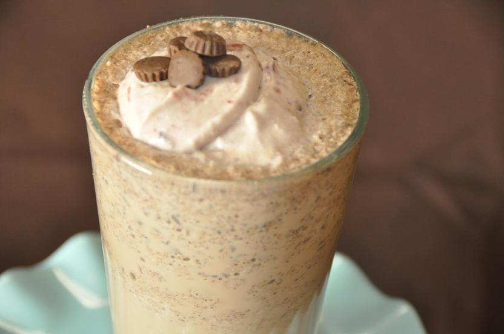

Fonte proteica : latte di mandorla, burro di mandorle (anche di arachidi va benissimo), semi di chia

Facilissimo da preparare, consiste di soli 4 ingredienti: il latte di mandorla ed il burro di arachidi o di mandorle sono la fondamentale fonte proteica, assieme ai semi di chia che sono anche ricchi di antiossidanti e di omega 3, fondamentali per il cuore. Bevilo a colazione o nel pomeriggio come snack, magari con l’ aggiunta di zenzero, che non soltanto dà maggior sapore allo shake, ma aiuta a disfarsi dei grassi (soprattutto quelli attorno all’ombelico!!!) e aiuta a stabilizzare la concentrazione di zuccheri nel sangue.

Ingredients
===========

* 1/2 banana
* 1 tazza di latte di mandorla
* 1 cucchiaio di burro di mandorle
* 1 cucchiaio di semi di chia

#### Optional

* zenzero
* polvere di cacao
* frutti di bosco (o altra frutta a scelta)
* foglie di spinaci

Preparation
===========

Unire tutto nel frullatore e dargli la consistenza cremosa desiderata

Notes
=====

1 porzione contiene 280 calorie di cui: 14 gr di grassi, 1 gr di grassi saturi, 9 gr di fibre, 17 gr di zuccheri, 7.5 gr di proteine
