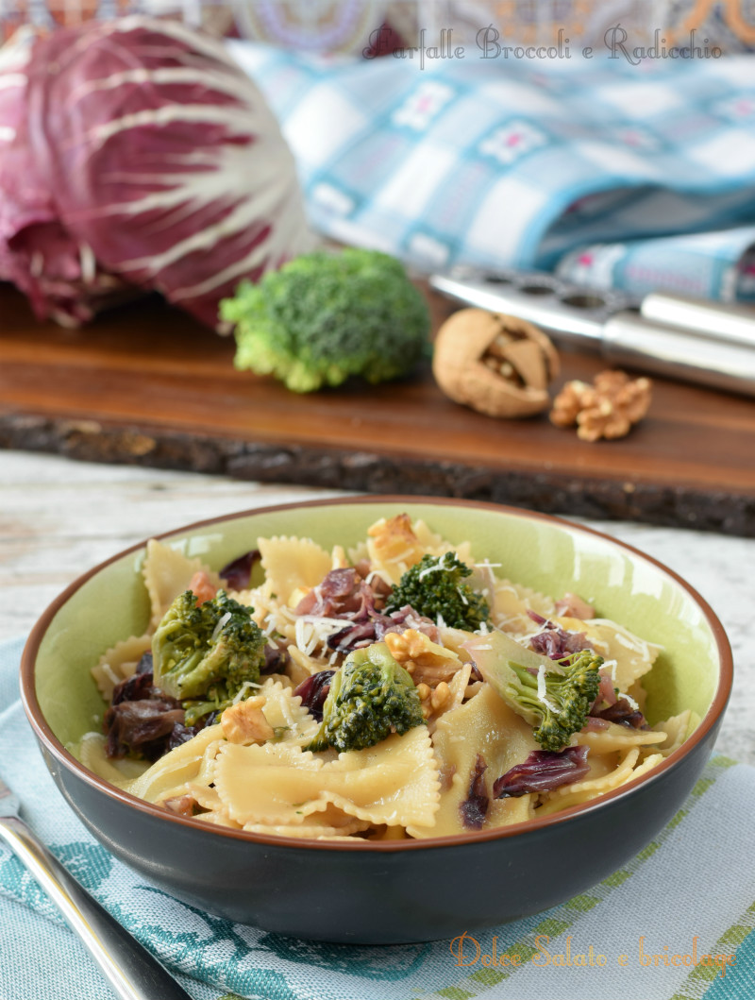

Farfalle broccoli e radicchio. Rinunciare ad un piatto di pasta è sempre difficile anche quando non si ha troppo tempo. Con solo pochi ingredienti possiamo preparare un primo piatto veloce, semplice e che di sicuro può soddisfare il nostro palato.

Dunque aprite il vostro frigo, troverete sicuramente gli ingredienti necessari per la preparazione delle farfalle broccoli e radicchio.
This would be the description of the recipe. Any info or history about the recipe goes here

Ingredients
===========

* 100gr di broccoli
* 150gr di radicchio
* 50gr di noci sgusciate (in alternativa 20 nocciole)
* 4tbsp olio di oliva
* 300gr di pasta tipo farfalle
* 100gr di parmigiano grattugiato
* sale, pepe q.b.

Preparation
===========

Staccate le cime dei broccoli, tagliate in due le cime più grosse, tagliate a strisce il radicchio, lavate il tutto e scolatele. Tritate grossolanamente le noci, unitele in una padella con l’olio di oliva assieme alle verdure, aggiungete 1/2 bicchiere d’acqua, salate, pepate e cuocete per 10-15. Cuocete le farfalle in abbondante acqua salata per il tempo indicato sulla confezione, scolate direttamente in padella con le verdure aggiungendo un mestolo di acqua di cottura. Lasciate mantecare tutti gli ingredienti per 5 minuti e cospargete  il parmigiano.

Notes
=====
