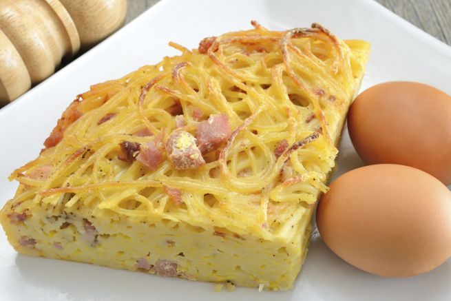

Avete voglia di un primo piatto speciale e sfizioso da mangiare a casa oppure portare al mare o per un pic nic? Provate la frittata di pasta al forno, un primo piatto davvero squisito che potete preparare con gli avanzi ma anche fare in anticipo e portare con voi.

Ingredients
===========

* 350gr di pasta già cotta
* 2 uova
* Sale
* Pepe
* 70gr di parmigiano
* 200gr di mozzarella
* Prezzemolo
* Pangrattato
* Olio extravergine di oliva

Preparation
===========

Per preparare questo piatto potete usare qualsiasi avanzo di pasta già condita. Prendete una insalatiera e sgusciate le uova, sbattetele con la forchetta e aggiungete il sale, il pepe e il parmigiano, mescolate bene e aggiungete la pasta, unite il prezzemolo e la mozzarella a cubetti. Mescolate bene tutto fino ad avere un composto omogeneo.

Prendete una pirofila e foderatela con la carta da forno, ungetela con un po’ di olio extravergine di oliva e poi fate uno strato sottilissimo di pangrattato, versate il composto di pasta e poi completate con il pangrattato e un goccio di olio. Livellate il composto e poi cuocete la frittata di pasta in forno preriscaldato a 180 per 25 minuti circa. 

Notes
=====
