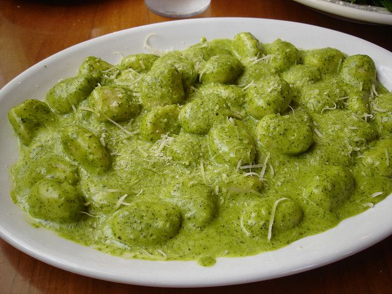

Un primo semplice da realizzare ma allettante come non mai, adatto ad essere servito nell'ambito del pranzo della domenica come alternativa alle classiche lasagne. Una ricetta collaudata per preparare la besciamella in casa è questa, seguitela per un risultato garantito.

Ingredients
===========

* 500gr di gnocchi di patate
* 300ml di besciamella
* 100gr di pesto alla genovese
* sale e pepe
* 50gr di parmigiano grattugiato

Preparation
===========

Fare cuocere gli gnocchi in acqua bollente salata fino a quando salgono a galla quindi scolarli immediatamente. Nel frattempo mescolare la besciamella pronta con il pesto ed unire poco parmigiano. Regolare di sale e pepe. Unire agli gnocchi la maggior parte della besciamella, quindi trasferire in una teglia da forno e completare coprendo con la besciamella rimasta ed una spolverata di parmigiano grattugiato in superficie. Fare cuocere a 180 °C per circa 15-20 minuti.

Notes
=====
