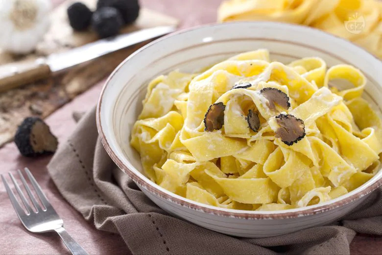

Le pappardelle al tartufo e crema al mascarpone sono un gustoso primo piatto, ottimo da preparare per le occasioni speciali. Le pappardelle infatti vengono impreziosite dal re dei funghi: il tartufo, che viene tagliato in scaglie sottili e aggiunto alla crema di mascarpone.  

L'aroma fruttato e speziato del tartufo si sposa bene con il sapore cremoso e delicato del mascarpone, per creare un piatto raffinato e  al tempo stesso molto semplice e veloce da preparare.

Ingredients
===========

* 250gr Pappardelle all'uovo
* 40gr Tartufo nero
* 250gr Mascarpone
* 5 Acciughe (alici) filetti sott'olio
* 2tbsp Olio extravergine d'oliva
* Sale fino
* 1 spicchio d'aglio

Preparation
===========

Per preparare le pappardelle al tartufo con crema di mascarpone fate appassire a fuoco dolce uno spicchio d’aglio, con poco olio extravergine d’oliva e, quando si sarà ben dorato, eliminatelo. Aggiungete i filetti di acciuga e fateli sciogliere per bene, quindi unite il mascarpone e mescolate per amalgamare tutti gli ingredienti. Stemperate, sempre a fuoco dolce, per pochi minuti e aggiustate di sale. In una pentola capiente con abbondante acqua salata fate cuocere le pappardelle e scolatele al dente. Aggiungete la pasta alla crema al mascarpone e fatela saltare qualche istante in padella. Guarnite con delle scaglie sottili di tartufo nero e mescolate bene per amalgamare il tutto. Servite le pappardelle al tartufo con crema di mascarpone ancora calde, guarnendo i piatti con le lamelle di tartufo grattugiate al momento.

Notes
=====
