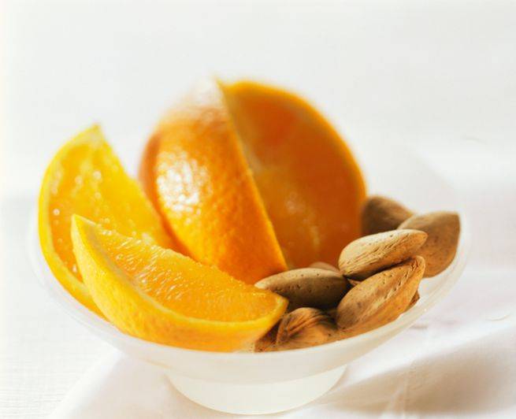

Amanti dei primi piatti particolari, del sapore agrumato e dei condimenti sfiziosi, ecco la pasta arancia e mandorle con la ricetta semplice e da non perdere. Di veloce esecuzione, si tratta di uno di quei piatti capaci di solleticare il palato e da proporre nell'ambito di una cena con amici.

Per rendere il condimento più cremoso potrete aggiungere qualche cucchiaio di panna fresca: il risultato sarà ancora più accattivante. Potrete, infine, giocare molto sulla presentazione del piatto, ricorrendo sia alle mandorle tritate che alle scorzette di arancia: a voi la scelta.

Ingredients
===========

* 320gr di pasta
* 60gr di mandorle
* 2 arance
* 50gr di burro
* 1 scalogno
* olio extra vergine di oliva
* sale e pepe

Preparation
===========

Affettare sottilmente lo scalogno e metterlo a soffriggere nel burro. Unire anche la scorza di un'arancia e la polpa affettata di tutte e due. Fare cuocere per qualche minuto. Mettere a lessare la pasta in acqua bollente salata. Scolarla al dente e trasferirla nel tegame. Unire le mandorle tritate e fare saltare bene il tutto, quindi regolare di sale e pepe e trasferire nei piatti da portata. Gustare subito.

Notes
=====
