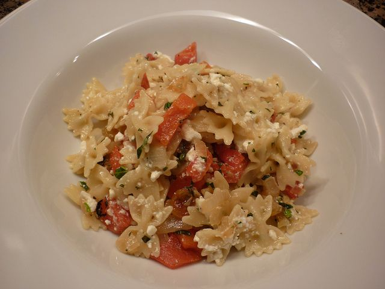

La pasta fredda rappresenta uno dei piatti più gettonati in estate: oggi ve ne propongo una variante appetitosa e semplice da realizzare. Munitevi di pomodorini freschi e secchi, di una confezione di feta e mettetevi all'opera. La pasta fredda con pomodori secchi e feta costituisce la soluzione ideale per il pranzo in casa, per quello in spiaggia ed una buona alternativa da inserire nel menù di Ferragosto. Fresca e colorata può essere realizzata in anticipo. Fate pure le aggiunte del caso unendo a piacere delle olive e dei capperi o semplicemente del mais.

Ingredients
===========

* 320gr di pasta corta
* 240gr di pomodori pachino
* 60gr di pomodori secchi sott’olio
* 150gr di formaggio feta
* 1 pizzico di sale
* pepe qb
* olio extravergine di oliva qb
* basilico fresco qb

Preparation
===========

Fare bollire la pasta in acqua bollente salata fino a quando risulta al dente, quindi scolarla e trasferirla in una insalatiera con poco olio. Nel frattempo lavare accuratamente i pomodorini e tagliarli in quarti. Tagliare la feta a dadini ed i pomodori secchi, sgocciolati dall’olio, a listarelle. Riunire il tutto nell'insalatiera con la pasta, regolare di sale e pepe e unire ancora poco olio e del basilico. Mescolare bene e servire fredda.

Notes
=====
