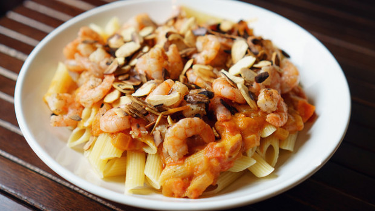

Ingredients
===========

* 320gr di penne rigate
* 60gr di mandorle
* 400gr di gamberetti
* 1 spicchio di aglio
* olio di oliva qb
* sale e pepe
* prezzemolo fresco

Preparation
===========

Mettere a bollire l'acqua per la pasta. Nel frattempo in una padella versare l'aglio e l'olio a fuoco basso. Unire i gamberi e farli cuocere per circa 3-4 minuti. Unire la pasta scolata al dente e completare la cottura regolando di sale e pepe, unendo le mandorle tostate tritate grossolanamente e il prezzemolo. fare insaporire bene quindi servire.

Notes
=====
